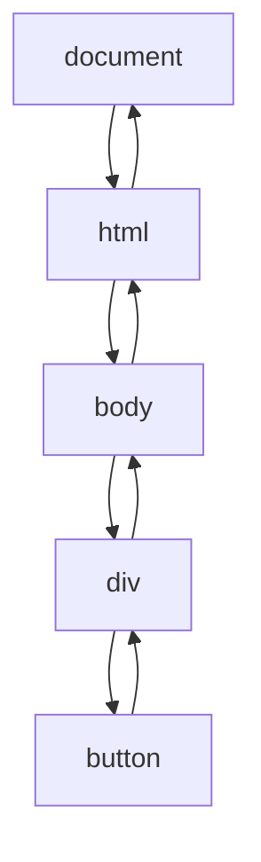

> “事件是用户与网页交互的灵魂，而理解事件的传播机制，就像掌握了网页的脉搏。”

在前端开发的旅途中，JavaScript 的事件机制无疑是核心中的核心。无论是点击按钮、滚动页面，还是敲击键盘，每一次用户交互都离不开事件的触发与处理。而在这背后，**事件冒泡**和**事件捕获**作为事件传播的两大机制，默默地决定了事件如何在 DOM 树中流动。🌊

这篇文章将带你从零到一，深入探索事件冒泡与事件捕获的方方面面。我们不仅会剖析它们的底层原理，还会结合丰富的代码示例、最佳实践，甚至加入一些类比和幽默，让你既能学到干货，又能感受到学习的乐趣。无论你是初学者还是有经验的开发者，这篇长达万字的指南都将为你提供全新的视角和实用的技巧。🚀

---

## 什么是事件冒泡与事件捕获？ 🤔

在深入细节之前，我们先来搞清楚这两个概念的本质。想象一下，你在水族馆里丢了一颗石子到水面上，水面会泛起涟漪，从中心向外扩散（冒泡），同时，水下的鱼儿也会感受到从水面传来的震动（捕获）。在 JavaScript 中，事件传播就像这颗石子引发的涟漪，只不过它发生在 DOM 树中。

### 定义与区别

- **事件冒泡（Event Bubbling）**：事件从触发事件的元素开始，沿着 DOM 树 **向上**传播，直到文档根节点（`document`）或被某个监听器阻止为止。  
  *类比*：就像你在公司里提交了一份报告，从你开始，报告会一级一级向上汇报，直到 CEO（或者被某个经理拦截）。

- **事件捕获（Event Capturing）**：事件从最外层的元素（通常是 `document`）开始，沿着 DOM 树 **向下**传播，直到到达触发事件的元素。  
  *类比*：就像 CEO 下达了一项命令，命令从上到下逐级传达，直到具体执行的人。

### 事件流的三个阶段

根据 W3C 的 DOM 事件模型，事件传播分为三个阶段：

1. **捕获阶段（Capturing Phase）**：事件从 `document` 开始，向下传播到目标元素。
2. **目标阶段（Target Phase）**：事件到达触发事件的元素本身。
3. **冒泡阶段（Bubbling Phase）**：事件从目标元素向上传播到 `document`。

下图展示了事件传播的路径：



*Tips：大多数事件都会经历这三个阶段，但某些事件（如 `focus` 和 `blur`）不支持冒泡，只发生在目标阶段。*

---

## 事件冒泡与捕获的底层原理 🔍

要真正理解事件冒泡和捕获，我们需要深入 JavaScript 的事件模型和浏览器的实现原理。这部分可能有点“硬核”，但别担心，我会用通俗的语言和类比让你轻松 get 到！😎

### 事件模型的历史演变

JavaScript 的事件模型并不是一开始就这么完善的，它经历了三次大的演变：

1. **DOM0 级事件**：早期的 `onclick`、`onmouseover` 等，直接绑定在元素上，只支持冒泡，且无法移除监听器。
   ```javascript
   document.getElementById('btn').onclick = function() {
     console.log('Clicked!');
   };
   ```

2. **DOM2 级事件**：引入了 `addEventListener` 和 `removeEventListener`，支持冒泡和捕获，允许绑定多个监听器。
   ```javascript
   document.getElementById('btn').addEventListener('click', () => {
     console.log('Clicked!');
   }, false); // 第三个参数为 false，表示冒泡
   ```

3. **DOM3 级事件**：扩展了事件类型（如触摸事件、鼠标滚轮事件），并进一步规范了事件流。

*Tips：始终使用 `addEventListener` 而非 DOM0 级事件，因为它更灵活，且支持事件捕获。*

### 浏览器的实现机制

当用户点击页面上的一个元素时，浏览器会：

1. **构建事件对象**：浏览器生成一个 `Event` 对象（如 `MouseEvent`），包含事件的类型、目标元素等信息。
2. **确定传播路径**：浏览器根据 DOM 树结构，计算从 `document` 到目标元素的事件传播路径。
3. **执行捕获阶段**：从 `document` 开始，逐级调用捕获阶段的监听器。
4. **执行目标阶段**：调用目标元素上的监听器（无论捕获还是冒泡）。
5. **执行冒泡阶段**：从目标元素开始，逐级调用冒泡阶段的监听器。

*类比*：就像一场接力赛，事件对象是接力棒，DOM 树上的每个元素是选手，捕获阶段是“向下传递”，冒泡阶段是“向上回传”。

### 事件对象的传播控制

事件对象提供了几个方法来控制传播：

- `event.stopPropagation()`：阻止事件继续传播（捕获或冒泡阶段都有效）。
- `event.stopImmediatePropagation()`：不仅阻止传播，还阻止同一元素上的其他监听器执行。
- `event.preventDefault()`：阻止事件的默认行为（如阻止链接跳转）。

*Tips：使用 `stopPropagation` 时要谨慎，因为它可能会干扰其他监听器，导致意想不到的 bug。*

---

## 代码示例：冒泡与捕获的实际表现 🛠️

让我们通过一个实际的例子来直观感受事件冒泡和捕获的区别。假设有以下 HTML 结构：

```html
<div id="outer">
  <div id="inner">
    <button id="btn">Click Me!</button>
  </div>
</div>
```

### 示例 1：事件冒泡

我们为每个元素绑定一个冒泡阶段的点击事件监听器：

```javascript
const outer = document.getElementById('outer');
const inner = document.getElementById('inner');
const btn = document.getElementById('btn');

outer.addEventListener('click', () => console.log('Outer clicked (bubbling)'), false);
inner.addEventListener('click', () => console.log('Inner clicked (bubbling)'), false);
btn.addEventListener('click', () => console.log('Button clicked (bubbling)'), false);
```

当点击按钮时，控制台输出：

```
Button clicked (bubbling)
Inner clicked (bubbling)
Outer clicked (bubbling)
```

**分析**：事件从按钮开始，逐级向上冒泡，先触发按钮的监听器，再触发内层 `div`，最后触发外层 `div`。

*Tips：冒泡是默认行为，适合大多数场景，如事件委托。*

### 示例 2：事件捕获

现在，我们将监听器设置为捕获阶段：

```javascript
outer.addEventListener('click', () => console.log('Outer clicked (capturing)'), true);
inner.addEventListener('click', () => console.log('Inner clicked (capturing)'), true);
btn.addEventListener('click', () => console.log('Button clicked (capturing)'), true);
```

点击按钮，控制台输出：

```
Outer clicked (capturing)
Inner clicked (capturing)
Button clicked (capturing)
```

**分析**：事件从 `document` 开始向下传播，先触发外层 `div`，再触发内层 `div`，最后到达按钮。

*Tips：捕获阶段适合需要在父元素上提前处理事件的情况，如拦截某些特定的事件。*

### 示例 3：混合使用冒泡与捕获

如果同时使用冒泡和捕获，会怎样呢？

```javascript
outer.addEventListener('click', () => console.log('Outer (capturing)'), true);
inner.addEventListener('click', () => console.log('Inner (bubbling)'), false);
btn.addEventListener('click', () => console.log('Button (capturing)'), true);
btn.addEventListener('click', () => console.log('Button (bubbling)'), false);
```

点击按钮，输出：

```
Outer (capturing)
Button (capturing)
Button (bubbling)
Inner (bubbling)
```

**分析**：

1. **捕获阶段**：从外到内，先触发 `outer` 的捕获监听器，再触发 `btn` 的捕获监听器。
2. **目标阶段**：`btn` 上的捕获和冒泡监听器都会触发（顺序取决于绑定顺序）。
3. **冒泡阶段**：从内到外，触发 `inner` 的冒泡监听器。

*Tips：混合使用冒泡和捕获时，建议明确事件处理逻辑，避免代码难以维护。*

---

## 事件冒泡与捕获的优缺点对比 📊

为了更清晰地理解两者的适用场景，我们用一个表格来对比：

| 特性                | 事件冒泡                              | 事件捕获                              |
|---------------------|---------------------------------------|---------------------------------------|
| **传播方向**        | 从目标元素向上传播到 `document`       | 从 `document` 向下传播到目标元素      |
| **默认行为**        | 是（`addEventListener` 默认使用冒泡） | 否（需显式设置 `useCapture` 为 `true`） |
| **使用场景**        | 事件委托、动态元素事件绑定            | 提前拦截事件、特定父元素逻辑处理      |
| **性能影响**        | 通常更高效（只需绑定父元素）          | 可能稍复杂（需处理更多层级）          |
| **常见问题**        | 可能触发不需要的父元素监听器          | 可能被子元素的事件阻止传播            |
| **适用性**          | 更通用，适合大多数交互场景            | 更适合特定需求，如拦截或优先处理      |

*Tips：选择冒泡还是捕获，取决于你的业务需求。90% 的场景下，冒泡就够用了！*

---

## 事件委托：冒泡机制的“超级英雄” 🦸‍♂️

事件冒泡最强大的应用之一就是**事件委托**。它利用了事件冒泡的特性，通过在父元素上绑定事件来处理子元素的事件，从而减少内存占用，提高性能。

### 事件委托的原理

假设你有一个动态生成的列表：

```html
<ul id="list">
  <li>Item 1</li>
  <li>Item 2</li>
  <li>Item 3</li>
</ul>
```

如果为每个 `<li>` 绑定点击事件：

```javascript
document.querySelectorAll('li').forEach(li => {
  li.addEventListener('click', () => console.log(`Clicked ${li.textContent}`));
});
```

问题来了：如果列表是动态生成的，新增的 `<li>` 不会自动绑定事件！而且，绑定大量监听器会增加内存开销。

**解决办法**：使用事件委托，在父元素上绑定一个监听器：

```javascript
document.getElementById('list').addEventListener('click', (event) => {
  if (event.target.tagName === 'LI') {
    console.log(`Clicked ${event.target.textContent}`);
  }
});
```

**优点**：
- 动态添加的 `<li>` 也能触发事件。
- 只需一个监听器，减少内存占用。
- 代码更简洁，维护更方便。

*Tips：事件委托适合列表、表格等动态内容，但要确保检查 `event.target` 以避免误触发。*

### 事件委托的进阶用法

1. **多类型元素处理**：
   ```javascript
   document.getElementById('container').addEventListener('click', (event) => {
     if (event.target.matches('.btn')) {
       console.log('Button clicked');
     } else if (event.target.matches('.link')) {
       console.log('Link clicked');
     }
   });
   ```

2. **自定义数据绑定**：
   使用 `data-` 属性传递信息：
   ```html
   <ul id="list">
     <li data-id="1">Item 1</li>
     <li data-id="2">Item 2</li>
   </ul>
   ```
   ```javascript
   document.getElementById('list').addEventListener('click', (event) => {
     if (event.target.tagName === 'LI') {
       const id = event.target.dataset.id;
       console.log(`Clicked item with ID: ${id}`);
     }
   });
   ```

*Tips：使用 `event.target.closest('.selector')` 可以查找最近的匹配祖先元素，增强事件委托的灵活性。*

---

## 常见问题与解决方案 🛠️

在实际开发中，事件冒泡和捕获可能会引发一些问题。以下是常见场景及解决方案：

### 问题 1：事件被意外阻止

**场景**：你在子元素上调用了 `event.stopPropagation()`，导致父元素的监听器未触发。

**解决方案**：检查代码逻辑，避免滥用 `stopPropagation`。如果需要父元素也能响应事件，可以通过自定义事件或重新设计逻辑解决。

```javascript
btn.addEventListener('click', (event) => {
  console.log('Button clicked');
  // 避免直接调用 event.stopPropagation()
  // 可以触发自定义事件
  const customEvent = new Event('buttonClicked');
  outer.dispatchEvent(customEvent);
});

outer.addEventListener('buttonClicked', () => {
  console.log('Outer received custom event');
});
```

*Tips：优先使用 `preventDefault` 而非 `stopPropagation`，除非你明确需要阻止传播。*

### 问题 2：事件委托中的性能瓶颈

**场景**：事件委托的监听器过于复杂，导致性能下降。

**解决方案**：优化监听器逻辑，减少不必要的计算。

```javascript
// 低效
document.getElementById('list').addEventListener('click', (event) => {
  const target = event.target;
  if (target.tagName === 'LI') {
    // 复杂的计算
    console.log(`Clicked ${target.textContent}`);
  }
});

// 优化
document.getElementById('list').addEventListener('click', (event) => {
  if (event.target.tagName !== 'LI') return;
  console.log(`Clicked ${event.target.textContent}`);
});
```

*Tips：在事件监听器中尽早返回（early return），避免不必要的逻辑执行。*

### 问题 3：捕获阶段的调试困难

**场景**：捕获阶段的事件监听器难以调试，因为它不像冒泡那样直观。

**解决方案**：使用浏览器的开发者工具，在“事件监听器”面板中查看捕获阶段的监听器，并添加日志。

```javascript
outer.addEventListener('click', (event) => {
  console.log('Capturing phase:', event.currentTarget);
}, true);
```

*Tips：调试捕获阶段时，可以临时将监听器改为冒泡，验证逻辑后再切换回捕获。*

---

## 最佳实践：让事件处理更优雅 ✨

为了让你的代码更健壮、更易维护，以下是一些经过实践验证的最佳实践：

1. **优先使用事件委托**  
   对于动态内容或大量子元素，使用事件委托可以显著提高性能和代码可维护性。  
   *Tips：确保事件委托的监听器逻辑简单，避免复杂的条件判断。*

2. **避免滥用 `stopPropagation`**  
   除非明确需要阻止事件传播，否则优先使用 `preventDefault` 或其他逻辑控制。  
   *Tips：记录 `stopPropagation` 的使用场景，方便后期调试。*

3. **为事件监听器命名**  
   使用命名函数而非匿名函数，便于调试和移除监听器。  
   ```javascript
   function handleClick() {
     console.log('Clicked');
   }
   btn.addEventListener('click', handleClick);
   // 移除时
   btn.removeEventListener('click', handleClick);
   ```  
   *Tips：命名函数还能提高代码可读性，尤其在大型项目中。*

4. **使用防抖和节流优化性能**  
   对于高频事件（如 `scroll`、`resize`），使用防抖或节流避免性能问题。  
   ```javascript
   function debounce(fn, delay) {
     let timer;
     return function (...args) {
       clearTimeout(timer);
       timer = setTimeout(() => fn.apply(this, args), delay);
     };
   }

   window.addEventListener('scroll', debounce(() => {
     console.log('Scrolled');
   }, 100));
   ```  
   *Tips：根据场景选择防抖（延迟执行）或节流（限制频率）。*

5. **清理事件监听器**  
   在组件销毁或元素移除时，及时移除事件监听器，防止内存泄漏。  
   ```javascript
   const btn = document.getElementById('btn');
   const handleClick = () => console.log('Clicked');
   btn.addEventListener('click', handleClick);

   // 清理
   btn.removeEventListener('click', handleClick);
   ```  
   *Tips：在框架（如 React）中，使用 `useEffect` 或类似机制管理监听器的生命周期。*

---

## 设计哲学与感悟 💭

事件冒泡和捕获的设计，体现了计算机科学中“分层”与“解耦”的哲学。冒泡机制让事件可以被更高层次的元素处理，捕获机制则允许提前干预，这种灵活性为开发者提供了无限可能。

> “好的设计不是让用户注意到它，而是让用户感觉不到它的存在。”  
> —— Don Norman，《设计心理学》

事件模型的设计正是如此：它默默运行在背后，却支撑了整个 Web 交互的复杂逻辑。作为开发者，我们需要学会“顺势而为”——利用冒泡的自然传播实现事件委托，同时在必要时通过捕获阶段精准控制。

此外，事件机制还启发我们思考**权衡**。冒泡高效但可能引发误触发，捕获精准但使用场景有限。开发中，我们常常需要在性能、灵活性和可维护性之间找到平衡。这种思维不仅适用于事件处理，也适用于架构设计、团队协作，甚至生活中的决策。

---

## 结语：从事件到人生 🌟

事件冒泡和捕获，看似是 JavaScript 中的技术细节，却蕴含了深刻的哲理。就像生活中的涟漪，我们的每一个行动（事件）都会在周围产生影响，向外扩散（冒泡），或者被更高层次的目标引导（捕获）。作为前端开发者，理解这些机制不仅让我们写出更优雅的代码，也让我们学会如何在复杂系统中找到自己的节奏。

希望这篇指南能为你带来启发！无论是初学者还是资深开发者，愿你在事件流的海洋中，找到属于自己的航线。⛵

---

## 附录：推荐资源 📚

- **MDN Web Docs**：关于 [DOM 事件](https://developer.mozilla.org/en-US/docs/Web/API/Event) 的权威文档。
- **《JavaScript 高级程序设计》**：深入讲解事件模型的经典书籍。
- **《你不知道的 JavaScript（中卷）》**：探讨事件机制的底层细节。
- **Can I Use**：检查事件相关 API 的浏览器兼容性。

---