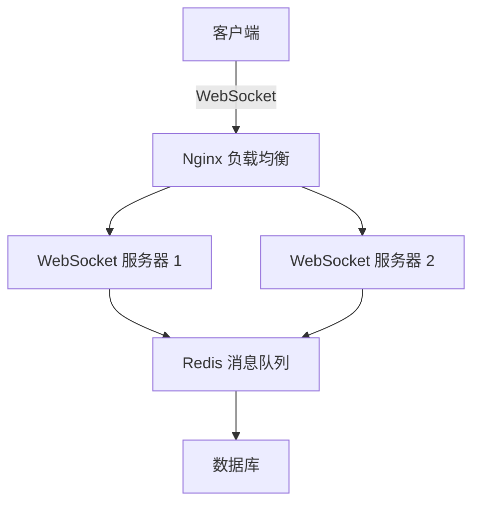

> “实时通信如风，瞬息万变；架构如山，稳若磐石。” —— 改编自《诗经·小雅·鹤鸣》

WebSocket，这个让无数前端开发者既爱又“恨”的技术，早已不是简单的“长连接”代名词。它是现代 Web 应用实时通信的基石，从聊天室到协同编辑，从实时股票行情到在线游戏，无处不在。🔥 但它的魅力远不止于此——WebSocket 不仅是一项技术，更是一种设计哲学的体现，是对“连接”与“即时”的深刻诠释。

作为一名前端开发者，你可能已经用过 WebSocket，甚至写过几个 `onopen` 和 `onmessage` 的回调。但你是否深入思考过它的内部机制？是否遇到过连接断开、消息丢失或性能瓶颈的困扰？是否想过如何在架构层面优雅地集成 WebSocket？本文将带你从原理到实践，从代码到架构，深入 WebSocket 的每一个角落，解锁它的全部潜力。🌟

这不仅是一篇技术博客，更是一场关于实时通信的思维之旅。我们将用清晰的表格、丰富的示例、幽默的笔触，以及一些诗意的点缀，带你领略 WebSocket 的技术美学。准备好了吗？让我们开始这场“双向奔赴”的冒险吧！🚀

## 一、WebSocket 是什么？从 HTTP 的“单向街”到双向通信

### 1.1 HTTP 的局限与 WebSocket 的诞生

HTTP 是一个“请求-响应”模型，像极了古代的书信往来：你写一封信（请求），对方回一封（响应），然后再写下一封。📜 这种模式在静态网页时代绰绰有余，但在实时性要求高的场景下（如聊天、实时协作），HTTP 就显得力不从心了。

为了弥补 HTTP 的不足，前端开发者们尝试了各种“黑科技”：

- **轮询（Polling）**：客户端每隔几秒问服务器：“有新消息吗？” 服务器要么说“有”，要么说“没有”。这种方式像是一个焦虑的恋人不停地打电话确认对方是否还爱自己，效率低下且浪费资源。😅
- **长轮询（Long Polling）**：客户端发起请求，服务器“吊着”不立即响应，直到有新数据。这种方式稍微优化了轮询，但仍然是“被动等待”，而且连接频繁断开重连，服务器压力不小。
- **Server-Sent Events（SSE）**：服务器可以主动推送数据，但仅限单向通信，客户端无法主动发送消息，像是收音机广播，适合实时通知但不适合双向交互。

WebSocket 的出现，彻底改变了游戏规则。🌍 它基于 TCP 协议，通过一次握手建立持久连接，允许客户端和服务器自由“对话”，无需反复握手。这种双向、全双工的通信模式，就像从“书信”升级到“电话”，甚至是“视频通话”。🎥

> *“世人之心，瞬息万变，WebSocket 如清风，连接无间。”*  
> —— 灵感源自李白《将进酒》

*Tips：**在选择通信方式时，优先考虑应用场景。如果只需要服务器单向推送（如实时通知），SSE 可能是更轻量的选择；如果需要双向交互，WebSocket 是最佳拍档。*

### 1.2 WebSocket 的核心特性

WebSocket 的设计哲学可以用“简洁、高效、实时”来概括。以下是它的核心特性，配以一张清晰的表格对比 HTTP 和 WebSocket：

| **特性**                | **HTTP**                              | **WebSocket**                        |
|-------------------------|---------------------------------------|--------------------------------------|
| **通信模式**            | 请求-响应，单向                     | 双向、全双工                        |
| **连接方式**            | 短连接（每次请求新建连接）          | 长连接（一次握手，持续通信）        |
| **协议**                | HTTP/1.1 或 HTTP/2                  | ws:// 或 wss://（基于 TCP）         |
| **数据格式**            | 文本、JSON、表单等                  | 文本、二进制（灵活性更高）          |
| **实时性**              | 依赖轮询或长轮询，延迟较高          | 接近实时，延迟极低                  |
| **服务器资源占用**      | 频繁建立/关闭连接，资源消耗大       | 单一长连接，资源占用低              |
| **适用场景**            | 静态页面、表单提交                 | 聊天、协作工具、实时数据推送        |

*Tips：**WebSocket 的 wss:// 协议使用 TLS 加密，类似 HTTPS，生产环境中务必使用 wss:// 以确保安全性。*

### 1.3 WebSocket 的协议与握手过程

WebSocket 协议（RFC 6455）基于 TCP，但它并不是“裸 TCP”。它在 TCP 之上定义了一套轻量级的协议，分为**握手阶段**和**数据传输阶段**。

#### 握手阶段

WebSocket 的握手是通过 HTTP 完成的（是的，你没看错，WebSocket 离不开 HTTP 的“助攻”）。客户端发送一个 HTTP 请求，包含特定的头信息：

```http
GET /chat HTTP/1.1
Host: server.example.com
Upgrade: websocket
Connection: Upgrade
Sec-WebSocket-Key: x3JJHMbDL1EzLkh9GBhXDw==
Sec-WebSocket-Version: 13
```

服务器响应一个状态码为 `101 Switching Protocols` 的 HTTP 响应，表示协议切换：

```http
HTTP/1.1 101 Switching Protocols
Upgrade: websocket
Connection: Upgrade
Sec-WebSocket-Accept: HSmrc0sMlYUkAGmm5OPpG2HaGWk=
```

这个过程就像一场“秘密握手”：客户端说“我想用 WebSocket”，服务器说“好，切换协议吧”。🔒

#### 数据传输阶段

握手完成后，连接进入数据传输阶段。WebSocket 使用**帧（Frame）**作为数据传输单位，每帧包含：

- **操作码（Opcode）**：指示数据类型（如文本、二进制、关闭连接等）。
- **有效载荷（Payload）**：实际传输的数据。
- **掩码（Masking）**：客户端发送的数据需要掩码处理，以防止恶意脚本攻击。

*Tips：**调试 WebSocket 时，可以使用浏览器的开发者工具（Network 面板）查看握手请求和帧数据，或者使用工具如 Postman 或 WebSocket King。*

## 二、WebSocket 的实现：从浏览器到服务器

### 2.1 浏览器中的 WebSocket API

前端开发者最常接触的是浏览器提供的 `WebSocket` 对象。它的 API 简单到令人感动，但功能强大到让人敬畏。😍 以下是一个基本的 WebSocket 连接示例：

```mdx
const socket = new WebSocket('ws://localhost:8080');

socket.onopen = () => {
  console.log('🎉 连接成功！');
  socket.send('Hello, Server!');
};

socket.onmessage = (event) => {
  console.log('📩 收到消息：', event.data);
};

socket.onerror = (error) => {
  console.error('😵 连接出错：', error);
};

socket.onclose = () => {
  console.log('😢 连接关闭');
};
```

这段代码就像一个“初次约会”的剧本：建立连接（`onopen`）、发送消息（`send`）、接收消息（`onmessage`）、处理错误（`onerror`）和告别（`onclose`）。💌

*Tips：**始终监听 `onerror` 和 `onclose` 事件，记录错误信息并制定重连策略，以提升用户体验。*

### 2.2 服务器端的 WebSocket 实现

WebSocket 的服务器端实现可以选择多种语言和框架。以下是一个使用 Node.js 和 `ws` 库的简单示例：

```javascript
const WebSocket = require('ws');
const server = new WebSocket.Server({ port: 8080 });

server.on('connection', (ws) => {
  console.log('🎉 新客户端连接！');

  ws.on('message', (message) => {
    console.log('📩 收到消息：', message.toString());
    ws.send(`服务器回复：${message}`);
  });

  ws.on('close', () => {
    console.log('😢 客户端断开连接');
  });
});

console.log('🚀 WebSocket 服务器运行在 ws://localhost:8080');
```

这个服务器像一个热情的“客服”，随时响应客户端的消息，并原样回传。🎤

*Tips：**生产环境中，建议使用 Nginx 或其他反向代理来处理 WebSocket 连接，设置合理的超时和心跳机制。*

### 2.3 WebSocket 的消息格式与二进制支持

WebSocket 支持两种主要数据格式：

- **文本**：通常是字符串或 JSON，适合结构化数据。
- **二进制**：包括 `ArrayBuffer` 和 `Blob`，适合传输图片、音频或视频。

以下是一个发送二进制数据的示例：

```javascript
const socket = new WebSocket('ws://localhost:8080');

socket.onopen = () => {
  const buffer = new ArrayBuffer(8);
  const view = new DataView(buffer);
  view.setInt32(0, 12345);
  socket.send(buffer);
  console.log('📦 发送二进制数据');
};

socket.onmessage = (event) => {
  if (event.data instanceof Blob) {
    event.data.arrayBuffer().then((buffer) => {
      const view = new DataView(buffer);
      console.log('📥 收到二进制数据：', view.getInt32(0));
    });
  }
};
```

*Tips：**处理二进制数据时，注意浏览器对 `Blob` 和 `ArrayBuffer` 的支持，优先使用 `ArrayBuffer` 以获得更高的性能。*

## 三、WebSocket 的进阶实践

### 3.1 心跳机制：让连接“永葆青春” 💓

WebSocket 连接可能因网络不稳定或服务器超时而断开。为了保持连接的“活力”，我们需要实现心跳机制：客户端定期发送“ping”消息，服务器回复“pong”消息。

以下是一个心跳机制的实现：

```javascript
class WebSocketWithHeartbeat {
  constructor(url) {
    this.socket = new WebSocket(url);
    this.heartbeatInterval = null;
    this.init();
  }

  init() {
    this.socket.onopen = () => {
      console.log('🎉 连接成功');
      this.startHeartbeat();
    };

    this.socket.onmessage = (event) => {
      if (event.data === 'pong') {
        console.log('💓 收到心跳响应');
      } else {
        console.log('📩 收到消息：', event.data);
      }
    };

    this.socket.onclose = () => {
      console.log('😢 连接关闭，尝试重连');
      this.stopHeartbeat();
      setTimeout(() => this.init(), 5000);
    };
  }

  startHeartbeat() {
    this.heartbeatInterval = setInterval(() => {
      if (this.socket.readyState === WebSocket.OPEN) {
        this.socket.send('ping');
        console.log('💓 发送心跳');
      }
    }, 30000);
  }

  stopHeartbeat() {
    clearInterval(this.heartbeatInterval);
  }
}

const ws = new WebSocketWithHeartbeat('ws://localhost:8080');
```

这个心跳机制就像给 WebSocket 装了一个“心脏起搏器”，确保它时刻“活着”。⚡️

*Tips：**心跳间隔一般设为 30 秒到 60 秒，过短会增加服务器负担，过长可能无法及时检测断开。*

### 3.2 重连机制：从“断线”到“再续前缘”

网络世界无常，WebSocket 连接随时可能“失联”。一个健壮的 WebSocket 客户端需要实现自动重连逻辑，通常结合指数退避（Exponential Backoff）算法以避免频繁重试。

以下是一个带重连的 WebSocket 封装：

```javascript
class WebSocketWithReconnect {
  constructor(url, maxRetries = 5) {
    this.url = url;
    this.maxRetries = maxRetries;
    this.retryCount = 0;
    this.socket = null;
    this.connect();
  }

  connect() {
    this.socket = new WebSocket(this.url);

    this.socket.onopen = () => {
      console.log('🎉 连接成功');
      this.retryCount = 0;
    };

    this.socket.onclose = () => {
      console.log('😢 连接关闭');
      this.handleReconnect();
    };

    this.socket.onerror = () => {
      console.log('😵 连接错误');
    };
  }

  handleReconnect() {
    if (this.retryCount < this.maxRetries) {
      const delay = Math.pow(2, this.retryCount) * 1000; // 指数退避
      console.log(`⏳ 第 ${this.retryCount + 1} 次重试，等待 ${delay}ms`);
      setTimeout(() => {
        this.retryCount++;
        this.connect();
      }, delay);
    } else {
      console.log('😞 重试次数已达上限，放弃重连');
    }
  }

  send(message) {
    if (this.socket.readyState === WebSocket.OPEN) {
      this.socket.send(message);
    } else {
      console.log('⚠️ 连接未就绪，消息未发送');
    }
  }
}

const ws = new WebSocketWithReconnect('ws://localhost:8080');
ws.send('Hello, Server!');
```

这个重连逻辑就像一个执着的“追梦人”，无论遇到多少挫折，都会以更谨慎的步伐再次尝试。🌈

*Tips：**指数退避的基数和最大重试次数需要根据业务场景调整，建议记录重连日志以便调试。*

### 3.3 消息队列：避免“消息洪水” 🌊

在高并发场景下，客户端可能短时间内发送大量消息，导致服务器过载。实现一个消息队列可以有效控制发送速率：

```javascript
class WebSocketWithQueue {
  constructor(url) {
    this.socket = new WebSocket(url);
    this.messageQueue = [];
    this.isSending = false;
    this.init();
  }

  init() {
    this.socket.onopen = () => {
      console.log('🎉 连接成功');
      this.processQueue();
    };
  }

  send(message) {
    this.messageQueue.push(message);
    this.processQueue();
  }

  processQueue() {
    if (this.isSending || this.messageQueue.length === 0 || this.socket.readyState !== WebSocket.OPEN) {
      return;
    }

    this.isSending = true;
    const message = this.messageQueue.shift();
    this.socket.send(message);
    console.log('📤 发送消息：', message);

    setTimeout(() => {
      this.isSending = false;
      this.processQueue();
    }, 100); // 控制发送速率
  }
}

const ws = new WebSocketWithQueue('ws://localhost:8080');
ws.send('消息1');
ws.send('消息2');
```

消息队列就像一个“交通指挥官”，确保消息按序、有节制地发送，避免“道路拥堵”。🚦

*Tips：**根据服务器性能调整发送间隔，过短可能导致服务器压力，过长可能影响实时性。*

## 四、WebSocket 的性能优化与架构设计

### 4.1 性能优化：让 WebSocket 跑得更快 🏎️

WebSocket 的性能优化可以从以下几个方面入手：

#### 4.1.1 压缩消息

WebSocket 支持 `permessage-deflate` 扩展，可以压缩消息以减少带宽占用。以下是启用压缩的 Node.js 示例：

```javascript
const WebSocket = require('ws');
const server = new WebSocket.Server({
  port: 8080,
  perMessageDeflate: {
    zlibDeflateOptions: {
      chunkSize: 1024,
      memLevel: 7,
      level: 3,
    },
    zlibInflateOptions: {
      chunkSize: 10 * 1024,
    },
  },
});

server.on('connection', (ws) => {
  ws.on('message', (message) => {
    console.log('📩 收到消息：', message.toString());
    ws.send(message);
  });
});
```

*Tips：**压缩会增加 CPU 负载，建议根据消息大小和频率权衡是否启用。*

#### 4.1.2 减少不必要的心跳

心跳消息虽然重要，但过于频繁会增加带宽和服务器负担。可以根据网络状况动态调整心跳间隔，或者在客户端检测到用户不活跃时暂停心跳。

*Tips：**结合浏览器的 `visibilitychange` 事件，在页面隐藏时暂停心跳以节省资源。*

#### 4.1.3 使用二进制代替 JSON

JSON 是 WebSocket 常用的数据格式，但它的序列化和解析开销较大。在性能敏感的场景下，可以使用二进制格式（如 Protocol Buffers 或 MessagePack）。

*Tips：**二进制格式需要客户端和服务器协商一致，建议在开发初期定义好协议。*

### 4.2 架构设计：从单点到分布式

WebSocket 的架构设计需要考虑以下几个层面：

#### 4.2.1 单机部署

在小型应用中，单台服务器足以应对 WebSocket 连接。但需要注意：

- **连接数限制**：单台服务器的 TCP 连接数受限于操作系统和硬件。
- **内存管理**：每个 WebSocket 连接会占用一定内存，需监控内存使用情况。

*Tips：**使用 `ulimit` 调整服务器的文件描述符上限，以支持更多连接。*

#### 4.2.2 分布式部署

在高并发场景下，单台服务器可能成为瓶颈。分布式 WebSocket 架构通常包括：

- **负载均衡**：使用 Nginx 或 HAProxy 将 WebSocket 连接分发到多台后端服务器。
- **消息广播**：通过消息队列（如 Redis 或 Kafka）实现跨服务器的消息同步。
- **状态管理**：使用 Redis 或数据库存储用户和连接的状态信息。

以下是一个简单的分布式 WebSocket 架构图（Markdown 格式）：



*Tips：**在分布式系统中，确保消息队列的高可用性，避免单点故障。*

### 4.3 错误处理与监控

一个健壮的 WebSocket 系统需要完善的错误处理和监控机制：

- **错误分类**：将错误分为网络错误、协议错误和业务错误，分别处理。
- **日志记录**：记录连接、断开、错误和消息的详细信息，方便排查问题。
- **监控告警**：使用 Prometheus 和 Grafana 监控连接数、消息吞吐量和错误率。

*Tips：**为每个 WebSocket 连接分配一个唯一 ID，便于追踪和调试。*

## 五、WebSocket 的应用场景与案例分析

### 5.1 实时聊天应用

实时聊天是 WebSocket 的经典应用场景。以下是一个简化的聊天室实现：

```javascript
const WebSocket = require('ws');
const server = new WebSocket.Server({ port: 8080 });
const clients = new Set();

server.on('connection', (ws) => {
  clients.add(ws);
  console.log('🎉 新用户加入');

  ws.on('message', (message) => {
    const msg = JSON.stringify({
      user: '匿名用户',
      content: message.toString(),
      timestamp: new Date().toISOString(),
    });
    clients.forEach((client) => {
      if (client.readyState === WebSocket.OPEN) {
        client.send(msg);
      }
    });
  });

  ws.on('close', () => {
    clients.delete(ws);
    console.log('😢 用户离开');
  });
});
```

这个聊天室像一个“数字篝火”，用户围坐一圈，畅所欲言。🔥

*Tips：**为聊天消息添加序列号，防止客户端因网络延迟收到乱序消息。*

### 5.2 协同编辑工具

协同编辑工具（如 Google Docs）需要实时同步多个用户的操作。WebSocket 配合操作转换（Operational Transformation, OT）或冲突解决（CRDT）算法，可以实现高效的多人协作。

*Tips：**在协同编辑场景中，建议使用二进制格式传输操作日志，以减少带宽占用。*

### 5.3 实时数据可视化

在金融、物联网或监控系统中，WebSocket 可以推送实时数据到前端，用于动态图表更新。以下是一个简单的股票价格推送示例：

```javascript
const WebSocket = require('ws');
const server = new WebSocket.Server({ port: 8080 });

setInterval(() => {
  const price = (Math.random() * 1000).toFixed(2);
  server.clients.forEach((client) => {
    if (client.readyState === WebSocket.OPEN) {
      client.send(JSON.stringify({ symbol: 'AAPL', price }));
    }
  });
}, 1000);
```

*Tips：**为实时数据设置合理的推送频率，避免前端渲染压力过大。*

## 六、WebSocket 的未来与哲学思考

### 6.1 WebSocket 与 WebRTC 的对比

WebSocket 擅长结构化数据的实时传输，而 WebRTC 更适合音视频流。两者各有千秋，但在某些场景下可以结合使用。例如，在视频会议中，WebSocket 可以传输聊天消息和控制信令，WebRTC 负责音视频流。

*Tips：**评估实时需求时，明确数据类型和延迟要求，选择合适的协议组合。*

### 6.2 从 WebSocket 看架构设计

WebSocket 的设计哲学启发我们思考架构的几个关键问题：

- **松耦合**：客户端和服务器通过轻量协议通信，减少依赖。
- **高可用**：通过心跳和重连机制，确保系统健壮性。
- **可扩展**：支持从单机到分布式的平滑过渡。

> *“凡事预则立，不预则废。”*  
> —— 《 homebrew: https://brew.sh/2024/03/14/how-to-install-python-on-linux-macos-and-windows/  

WebSocket 的成功，源于其对实时通信的深刻洞察和对用户体验的极致追求。这不仅是技术的胜利，更是设计的胜利。

### 6.3 实时通信的未来

随着 5G 和边缘计算的普及，实时通信将迎来新的机遇。WebSocket 可能与新兴技术（如 gRPC-Web 或 QUIC）结合，创造更高效的通信模式。

> *“问渠那得清如许？为有源头活水来。”*  
> —— 朱熹《观书有感》

实时通信的“源头活水”，正是技术的不断创新。WebSocket 只是这条长河中的一站，未来还有更多可能等待我们探索。

## 七、总结与寄语

WebSocket 不仅是一项技术，更是一种连接世界的思维方式。它让我们看到，技术的本质是为人类创造更紧密、更即时的联系。🌍

作为前端开发者，掌握 WebSocket 不仅是为了写出更好的代码，更是为了在瞬息万变的技术世界中，找到属于自己的节奏和方向。愿你在这场 WebSocket 的冒险中，收获技术、灵感和成长。

> *“路漫漫其修远兮，吾将上下而求索。”*  
> —— 屈原《离骚》

愿你的代码如诗，架构如画，实时通信如风，吹遍世界的每一个角落。🌟

---