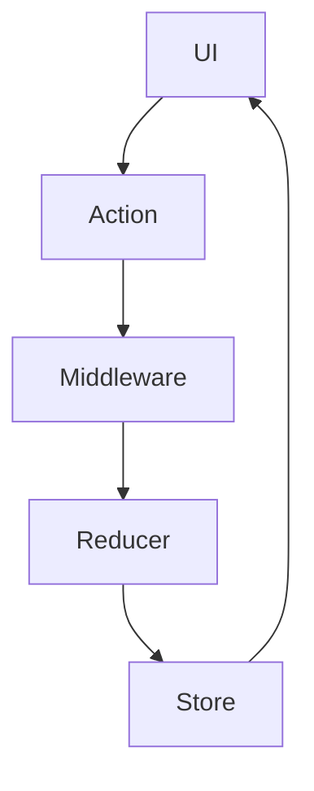

Redux 是一个用于 JavaScript 应用程序的状态管理库，广泛应用于前端开发中，尤其是在使用 React 框架时。它提供了可预测的状态容器，帮助开发者更轻松地管理复杂的应用状态。

## 什么是 Redux

Redux 是由 Dan Abramov 和 Andrew Clark 于 2015 年发布的一个开源库，其核心理念受到了 Flux 架构的启发。Redux 的设计目标是提供一种可预测的状态管理方式，通过集中式的状态存储和严格的更新规则，使应用程序的行为更加透明和可控。

### Redux 的三大核心原则

1. **单一数据源（Single Source of Truth）**  
   Redux 的状态存储在一个单一的 JavaScript 对象中，称为 Store。这种集中式存储使得状态管理变得简单明了。

2. **状态是只读的（State is Read-Only）**  
   唯一修改状态的方法是触发一个动作（Action），这确保了状态的变化是可追踪的。

3. **使用纯函数进行状态更改（Changes are Made with Pure Functions）**  
   状态的更新逻辑通过纯函数（Reducer）来实现，保证了状态更新的可预测性。

## Redux 的核心概念

### 1. Store
Store 是 Redux 应用的核心，它是保存整个应用状态的对象。通过 `createStore` 方法可以创建一个 Store：

```javascript
import { createStore } from 'redux';
import rootReducer from './reducers';

const store = createStore(rootReducer);
```

Store 提供了三个核心方法：
- `getState()`：获取当前状态。
- `dispatch(action)`：分发一个 Action，触发状态更新。
- `subscribe(listener)`：订阅状态变化，注册回调函数。

### 2. Action
Action 是一个描述状态变化的普通 JavaScript 对象，必须包含一个 `type` 字段：

```javascript
const incrementAction = {
  type: 'INCREMENT',
  payload: { amount: 1 }
};
```

Actions 通常通过 Action Creator 函数生成：

```javascript
function increment(amount) {
  return {
    type: 'INCREMENT',
    payload: { amount }
  };
}
```

### 3. Reducer
Reducer 是一个纯函数，负责根据当前状态和传入的 Action 返回新的状态：

```javascript
function counterReducer(state = { count: 0 }, action) {
  switch (action.type) {
    case 'INCREMENT':
      return { count: state.count + action.payload.amount };
    case 'DECREMENT':
      return { count: state.count - action.payload.amount };
    default:
      return state;
  }
}
```

### 4. Middleware
Middleware 用于拦截 `dispatch`，可以在 Action 到达 Reducer 之前执行额外的逻辑（如日志记录、异步请求等）。常用的 Redux 中间件包括 `redux-thunk` 和 `redux-saga`。

#### 使用 `redux-thunk` 示例

```javascript
import thunk from 'redux-thunk';
import { createStore, applyMiddleware } from 'redux';
import rootReducer from './reducers';

const store = createStore(rootReducer, applyMiddleware(thunk));

// 异步 Action Creator
function fetchData() {
  return async (dispatch) => {
    const data = await fetch('/api/data').then((res) => res.json());
    dispatch({ type: 'SET_DATA', payload: data });
  };
}
```

## Redux 的工作流程

Redux 的状态更新流程可以分为以下几个步骤：

1. **触发 Action**：通过 `dispatch(action)` 发起状态更新。
2. **Reducer 更新状态**：Reducer 接收当前状态和 Action，并返回新的状态。
3. **Store 保存新状态**：Store 保存 Reducer 返回的新状态，并通知所有订阅者。

以下是完整的工作流程图：



## 应用场景

Redux 适合以下场景：
- 应用状态复杂，需要在多个组件之间共享。
- 状态变化频繁且需要跟踪历史状态。
- 需要对状态管理流程进行严格的控制。

### 示例：计数器应用

以下是一个使用 Redux 的简单计数器示例：

```javascript
import { createStore } from 'redux';

// Reducer
function counterReducer(state = { count: 0 }, action) {
  switch (action.type) {
    case 'INCREMENT':
      return { count: state.count + 1 };
    case 'DECREMENT':
      return { count: state.count - 1 };
    default:
      return state;
  }
}

// 创建 Store
const store = createStore(counterReducer);

// 订阅状态变化
store.subscribe(() => console.log(store.getState()));

// 分发 Actions
store.dispatch({ type: 'INCREMENT' }); // { count: 1 }
store.dispatch({ type: 'DECREMENT' }); // { count: 0 }
```

## 与 React 集成

Redux 通常与 `react-redux` 库一起使用，以下是基本用法：

1. **安装依赖**：

```bash
npm install redux react-redux
```

2. **提供 Store**：

```javascript
import React from 'react';
import ReactDOM from 'react-dom';
import { Provider } from 'react-redux';
import { createStore } from 'redux';
import App from './App';
import rootReducer from './reducers';

const store = createStore(rootReducer);

ReactDOM.render(
  <Provider store={store}>
    <App />
  </Provider>,
  document.getElementById('root')
);
```

3. **连接组件**：

```javascript
import React from 'react';
import { useSelector, useDispatch } from 'react-redux';

function Counter() {
  const count = useSelector((state) => state.count);
  const dispatch = useDispatch();

  return (
    <div>
      <p>{count}</p>
      <button onClick={() => dispatch({ type: 'INCREMENT' })}>+1</button>
      <button onClick={() => dispatch({ type: 'DECREMENT' })}>-1</button>
    </div>
  );
}

export default Counter;
```

## 总结

Redux 是一个强大的状态管理工具，但并不是所有项目都需要使用它。小型应用或状态简单的场景下，可能更适合使用 React 的内置状态管理（如 `useState` 和 `useReducer`）。在复杂应用中，Redux 的集中式状态管理和可预测性能够显著提高开发效率和代码可维护性。
