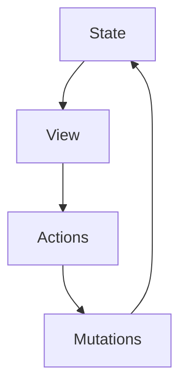

> “秩序是混乱的解药，而状态管理是前端秩序的基石。”

在前端开发的宇宙中，数据如星辰，组件如行星，而状态管理则是那无形的引力，将一切有序地连接起来。Vuex，作为 Vue.js 生态的官方状态管理库，不仅是一个工具，更是一种哲学的体现。它以简洁的 API、优雅的设计和强大的扩展性，赋予开发者在复杂应用中驯服数据的超能力。

本文将带你深入 Vuex 的世界，从核心原理到高级实践，从代码示例到架构思考，甚至上升到哲学与艺术的层面。无论你是 Vuex 的新手还是老司机，这场旅程都将让你重新审视状态管理，感受代码背后的诗意与智慧。🚀

## 思维链：为什么写这篇文章？

在动笔之前，我想先聊聊这篇文章的“来龙去脉”。Vuex 诞生于 Vue.js 的繁荣期，它解决了组件间通信的痛点，提供了集中式状态管理的范式。但随着前端生态的演进，Pinia 的崛起、React 的 Context API 和 Redux Toolkit 的流行，有人开始质疑：Vuex 还香吗？它是否已被时代抛弃？

答案是否定的。Vuex 不仅依然是许多 Vue 项目的首选状态管理方案，其设计理念——单向数据流、响应式原理、模块化——仍然是现代前端架构的基石。更重要的是，学习 Vuex 不仅是为了用好它，更是为了理解状态管理的本质，进而在设计复杂系统时游刃有余。

因此，这篇文章的目标是：

1. **全面解析 Vuex**：从基础到高级，覆盖原理、API 和最佳实践。
2. **结合实例**：通过真实场景和代码示例，让你不仅“看懂”，还能“上手”。
3. **融入哲学与艺术**：通过类比、名言和幽默，探讨状态管理的深层意义。
4. **提供实用价值**：分享最佳实践和踩坑经验，助你在项目中少走弯路。
5. **展现个人风格**：让文章读起来像一位老友的分享，而非冷冰冰的文档。

准备好了吗？让我们开始这场关于 Vuex 的冒险吧！🌌

## 一、Vuex 是什么？从“混乱”到“秩序”的魔法

Vuex 是 Vue.js 的官方状态管理库，灵感来源于 Flux 和 Redux，专为 Vue 的响应式系统量身定制。它通过集中式管理应用的状态，解决了组件间数据共享的复杂性，让数据流变得可预测、可追溯。

### 1.1 核心概念：Vuex 的“五位一体”

Vuex 的核心可以用五个关键词概括：**State**、**Getters**、**Mutations**、**Actions** 和 **Modules**。它们就像一支交响乐团的五个声部，各自发挥作用，又和谐共鸣。

| 概念       | 作用                                                                 | 类比                     |
|------------|----------------------------------------------------------------------|--------------------------|
| **State**  | 存储应用的全部状态，单一数据源（Single Source of Truth）。             | 宇宙的“真理之书”         |
| **Getters**| 从 State 中派生出计算属性，类似 Vue 的计算属性。                      | 书中的“索引”与“摘要”     |
| **Mutations**| 唯一修改 State 的方法，同步操作，必须是纯函数。                       | 书页的“编辑器”           |
| **Actions**| 处理异步逻辑或复杂操作，提交 Mutations 修改 State。                   | 图书管理员的“指令”       |
| **Modules**| 将 Store 拆分为模块，支持大型应用的模块化管理。                       | 书的“章节”与“子书”       |

*Tips：将 State 想象成一本“活的书”，Getters 是书的目录，Mutations 是编辑笔，Actions 是管理员，Modules 则是书的章节。这种类比能帮助你快速抓住 Vuex 的精髓。*

### 1.2 为什么需要 Vuex？

试想一个场景：你开发一个电商应用，包含商品列表、购物车、用户信息等组件。如果没有状态管理，这些组件的数据通信会变成“意大利面条”——props 层层传递，事件层层冒泡，代码维护成本飙升。😵

Vuex 的出现就像给这个混乱的世界带来了秩序。它通过集中式管理状态，让数据流变得可预测，避免了“谁改了我的数据？”的抓狂时刻。正如哲学家赫拉克利特所说：“万物皆流。” Vuex 让数据的流动清晰可见，宛如一条潺潺溪流。

*Tips：Vuex 并不适合所有项目。如果你的应用简单（如单页表单），直接使用 Vue 的响应式数据或 Composition API 可能更轻量。*

## 二、深入 Vuex 原理：响应式与单向数据流的艺术

Vuex 的强大不仅在于其 API 的简洁，更在于其与 Vue 响应式系统的无缝整合。让我们剥开 Vuex 的外衣，探索其内核。

### 2.1 Vuex 的响应式魔法

Vuex 的 State 是响应式的，这得益于 Vue 的核心——`Vue.set` 和 `Object.defineProperty`（Vue 2）或 `Proxy`（Vue 3）。当你将 State 注入到 Vue 组件中时，任何 State 的变化都会触发组件的重新渲染。

```javascript
// store/index.js
import Vue from 'vue';
import Vuex from 'vuex';

Vue.use(Vuex);

export default new Vuex.Store({
  state: {
    count: 0
  },
  mutations: {
    increment(state) {
      state.count++;
    }
  }
});
```

在这个例子中，`state.count` 是响应式的。当 `increment` Mutation 被调用时，任何依赖 `count` 的组件都会自动更新。这就像乐队的指挥挥动指挥棒，乐手们立即响应，演奏出和谐的旋律。🎶

*Tips：确保 State 中的对象和数组通过 `Vue.set` 或替换整个对象来更新，否则可能丢失响应式特性。*

### 2.2 单向数据流：秩序的基石

Vuex 遵循单向数据流的设计哲学：**State → View → Actions → Mutations → State**。这种模式确保了状态变化的可追溯性，避免了“黑箱操作”的混乱。



单向数据流就像一条河流，只能朝一个方向流动。任何逆流（直接修改 State）都会破坏系统的稳定性。这也是 Vuex 要求 Mutations 必须是同步的原因——异步操作会导致状态变化的不可预测。

*Tips：如果需要调试状态变化，强烈推荐使用 Vuex 的插件（如 Vuex Logger）或 Vue DevTools，它们能清晰展示每一步的状态流转。*

### 2.3 Vuex 的“插件化”哲学

Vuex 提供了一个强大的插件系统，允许开发者在状态变化时插入自定义逻辑。例如，你可以实现一个简单的日志插件：

```javascript
const logger = store => {
  store.subscribe((mutation, state) => {
    console.log(`Mutation: ${mutation.type}, Payload:`, mutation.payload);
    console.log('New State:', state);
  });
};

const store = new Vuex.Store({
  plugins: [logger],
  // ...
});
```

这个插件就像一个“状态侦探”，时刻监视着 Store 的动态。Vuex 的插件机制体现了其扩展性，允许开发者根据需求定制功能。

*Tips：插件是实现持久化存储（如 localStorage）或错误日志的绝佳方式，但要避免在插件中执行过多计算，以免影响性能。*

## 三、Vuex 的核心 API：从入门到精通

让我们通过代码示例，逐一探索 Vuex 的核心 API，感受其优雅与强大。

### 3.1 State：应用的“真理之书”

State 是 Vuex 的核心，存储所有共享数据。访问 State 有两种方式：通过 `this.$store.state` 或使用 `mapState` 辅助函数。

```javascript
// 在组件中使用
import { mapState } from 'vuex';

export default {
  computed: {
    ...mapState(['count']),
    // 或者自定义计算属性
    ...mapState({
      myCount: state => state.count
    })
  }
};
```

*Tips：优先使用 `mapState` 而非直接访问 `$store.state`，这样能让代码更简洁，且便于维护。*

### 3.2 Getters：数据的“索引与摘要”

Getters 类似 Vue 的计算属性，用于从 State 中派生数据。例如，过滤出已完成的任务：

```javascript
// store/index.js
export default new Vuex.Store({
  state: {
    todos: [
      { id: 1, text: 'Learn Vuex', done: true },
      { id: 2, text: 'Write Blog', done: false }
    ]
  },
  getters: {
    doneTodos: state => {
      return state.todos.filter(todo => todo.done);
    },
    doneTodosCount: (state, getters) => {
      return getters.doneTodos.length;
    }
  }
});
```

在组件中，可以通过 `mapGetters` 访问：

```javascript
import { mapGetters } from 'vuex';

export default {
  computed: {
    ...mapGetters(['doneTodos', 'doneTodosCount'])
  }
};
```

Getters 的缓存机制确保只有当依赖的数据变化时才会重新计算，这就像一本智能书籍，只在需要时更新索引。📚

*Tips：Getters 适合处理复杂的数据派生逻辑，避免在组件中重复计算。*

### 3.3 Mutations：状态的“编辑器”

Mutations 是修改 State 的唯一途径，必须是同步的纯函数。例如：

```javascript
// store/index.js
export default new Vuex.Store({
  state: {
    count: 0
  },
  mutations: {
    increment(state, payload) {
      state.count += payload.amount;
    }
  }
});
```

在组件中通过 `commit` 调用：

```javascript
this.$store.commit('increment', { amount: 10 });
```

或者使用 `mapMutations`：

```javascript
import { mapMutations } from 'vuex';

export default {
  methods: {
    ...mapMutations(['increment']),
    addTen() {
      this.increment({ amount: 10 });
    }
  }
};
```

*Tips：Mutations 的命名尽量清晰，例如 `incrementByAmount` 比 `update` 更能表达意图。*

### 3.4 Actions：异步逻辑的“指挥家”

Actions 处理异步操作或复杂逻辑，通过 `dispatch` 调用。例如，模拟一个异步获取用户信息的场景：

```javascript
// store/index.js
export default new Vuex.Store({
  state: {
    user: null
  },
  mutations: {
    setUser(state, user) {
      state.user = user;
    }
  },
  actions: {
    async fetchUser({ commit }, userId) {
      try {
        const response = await fetch(`/api/user/${userId}`);
        const user = await response.json();
        commit('setUser', user);
      } catch (error) {
        console.error('Fetch user failed:', error);
      }
    }
  }
});
```

在组件中：

```javascript
import { mapActions } from 'vuex';

export default {
  methods: {
    ...mapActions(['fetchUser']),
    async getUser() {
      await this.fetchUser(1);
    }
  }
};
```

Actions 就像一位经验丰富的指挥家，协调异步任务与同步修改，确保状态变化井然有序。🎻

*Tips：Actions 中尽量处理错误，避免让异常传播到组件层。*

### 3.5 Modules：大型应用的“章节划分”

对于复杂应用，单一 Store 会变得臃肿。Modules 允许将 Store 拆分为模块，每个模块有自己的 State、Getters、Mutations 和 Actions。

```javascript
// store/modules/cart.js
const cartModule = {
  namespaced: true,
  state: {
    items: []
  },
  mutations: {
    addItem(state, item) {
      state.items.push(item);
    }
  },
  actions: {
    async addToCart({ commit }, item) {
      // 模拟异步操作
      await new Promise(resolve => setTimeout(resolve, 1000));
      commit('addItem', item);
    }
  },
  getters: {
    itemCount: state => state.items.length
  }
};

// store/index.js
import cartModule from './modules/cart';

export default new Vuex.Store({
  modules: {
    cart: cartModule
  }
});
```

在组件中访问模块状态：

```javascript
import { mapState, mapActions } from 'vuex';

export default {
  computed: {
    ...mapState('cart', ['items']),
    ...mapGetters('cart', ['itemCount'])
  },
  methods: {
    ...mapActions('cart', ['addToCart'])
  }
};
```

Modules 的命名空间（`namespaced: true`）避免了命名冲突，就像一本书的章节各有其标题，互不干扰。

*Tips：模块化时，尽量让每个模块聚焦单一职责，例如 `cart` 模块只处理购物车相关逻辑。*

## 四、最佳实践：让 Vuex 更优雅

Vuex 的灵活性既是优点，也是“坑”的来源。以下是一些经过实战验证的最佳实践，助你在项目中游刃有余。

### 4.1 结构化 Store 目录

对于大型项目，推荐以下目录结构：

```
store/
├── index.js          # 主 Store 文件
├── modules/          # 模块目录
│   ├── cart.js       # 购物车模块
│   ├── user.js       # 用户模块
│   └── product.js    # 商品模块
├── getters.js        # 全局 Getters
├── mutations.js      # 全局 Mutations
├── actions.js        # 全局 Actions
└── types.js          # Mutation/Action 类型常量
```

示例 `types.js`：

```javascript
export const INCREMENT = 'INCREMENT';
export const FETCH_USER = 'FETCH_USER';
```

*Tips：使用常量定义 Mutation 和 Action 类型，避免拼写错误，提升代码可维护性。*

### 4.2 规范化 Mutation 命名

Mutation 命名应遵循“动词 + 名词”的模式，例如：

- `addItemToCart`
- `updateUserInfo`
- `clearCart`

这就像给书页的编辑操作取一个清晰的标题，让人一目了然。

*Tips：避免使用模糊的动词如 `update` 或 `set`，尽量具体化。*

### 4.3 异步操作的错误处理

在 Actions 中始终处理异步操作的错误。例如：

```javascript
actions: {
  async fetchData({ commit }) {
    try {
      const response = await fetch('/api/data');
      if (!response.ok) throw new Error('Network error');
      const data = await response.json();
      commit('setData', data);
    } catch (error) {
      commit('setError', error.message);
      throw error; // 让组件层也能捕获错误
    }
  }
}
```

*Tips：为错误状态专门设置一个 State 字段（如 `error`），便于在 UI 中展示错误信息。*

### 4.4 使用 Vuex 插件实现持久化

通过插件，可以将 State 持久化到 localStorage：

```javascript
const persistencePlugin = store => {
  // 初始化时从 localStorage 恢复状态
  const savedState = localStorage.getItem('vuex');
  if (savedState) {
    store.replaceState(JSON.parse(savedState));
  }

  // 每次 Mutation 后保存状态
  store.subscribe((mutation, state) => {
    localStorage.setItem('vuex', JSON.stringify(state));
  });
};

const store = new Vuex.Store({
  plugins: [persistencePlugin],
  // ...
});
```

*Tips：持久化时只保存必要的数据，避免存储敏感信息或过大数据量。*

### 4.5 动态注册模块

对于按需加载的模块，可以动态注册：

```javascript
// store/index.js
export default new Vuex.Store({
  modules: {}
});

// 动态注册模块
store.registerModule('dynamicModule', {
  state: { value: 0 },
  mutations: {
    increment(state) {
      state.value++;
    }
  }
});
```

*Tips：动态模块适合实现“插件式”功能，如第三方扩展或按需加载的业务模块。*

## 五、Vuex 的哲学：从代码到人生

Vuex 的设计不仅是为了管理状态，更是一种对秩序的追求。它的单向数据流、模块化、响应式原理，都体现了一种哲学：**在复杂系统中，简单和可预测是最高的智慧。**

### 5.1 类比：Vuex 与生活的秩序

Vuex 的单向数据流就像生活的规划：你设定目标（State），制定计划（Actions），执行步骤（Mutations），最终达成结果。这种秩序感在复杂项目中尤为重要。就像《道德经》中所说：“大音希声，大象无形。” Vuex 的优雅在于其简洁却强大的设计。

### 5.2 架构的启示

Vuex 的模块化设计启发我们在架构系统时，将复杂问题拆分为小而美的模块。这种“分而治之”的思想不仅适用于代码，也适用于团队协作和人生规划。正如建筑大师密斯·范德罗所说：“Less is more.” 在状态管理中，清晰的模块划分就是“少即是多”的体现。

### 5.3 艺术的共鸣

Vuex 的响应式系统就像一幅动态的画作：当数据（颜料）变化时，画布（组件）自动更新，呈现出新的画面。这种动态美感让人联想到印象派绘画——它捕捉瞬间，却又流露出永恒。

## 六、Vuex 的未来：与 Pinia 的对话

随着 Pinia 的流行，Vuex 是否会被取代？Pinia 提供了更轻量、更现代的 API，特别是在 Vue 3 和 Composition API 的加持下。但 Vuex 依然有其不可替代的优势：

- **成熟稳定**：Vuex 在大型项目中有丰富的实战经验。
- **生态支持**：Vuex 的插件和工具链更加完善。
- **学习曲线**：对于熟悉 Redux 的开发者，Vuex 的单向数据流更易上手。

然而，Pinia 的类型安全和更灵活的 API 确实更符合现代开发者的需求。未来，Vuex 可能会逐步向 Pinia 靠拢，或者两者并存，满足不同场景的需求。

*Tips：如果你的项目基于 Vue 3，且追求轻量化和类型安全，Pinia 可能是更好的选择。但在维护老项目或需要稳定生态时，Vuex 依然是王者。*

## 七、总结：Vuex 的诗意与力量

Vuex 不仅是一个状态管理库，更是一场关于秩序、优雅和智慧的旅程。它的设计哲学——单向数据流、响应式、模块化——不仅是技术的最佳实践，也是对复杂系统管理的深刻洞察。

在这篇文章中，我们从 Vuex 的核心概念出发，深入其原理，探索其 API，分享了最佳实践，并上升到哲学与艺术的层面。希望你在阅读后，不仅能更熟练地使用 Vuex，还能感受到代码背后的美感与力量。

> “代码是诗，状态是韵律，Vuex 是谱写秩序的乐章。” —— 晓龙

愿你在前端开发的道路上，用 Vuex 谱写属于自己的华丽篇章！🌟

---