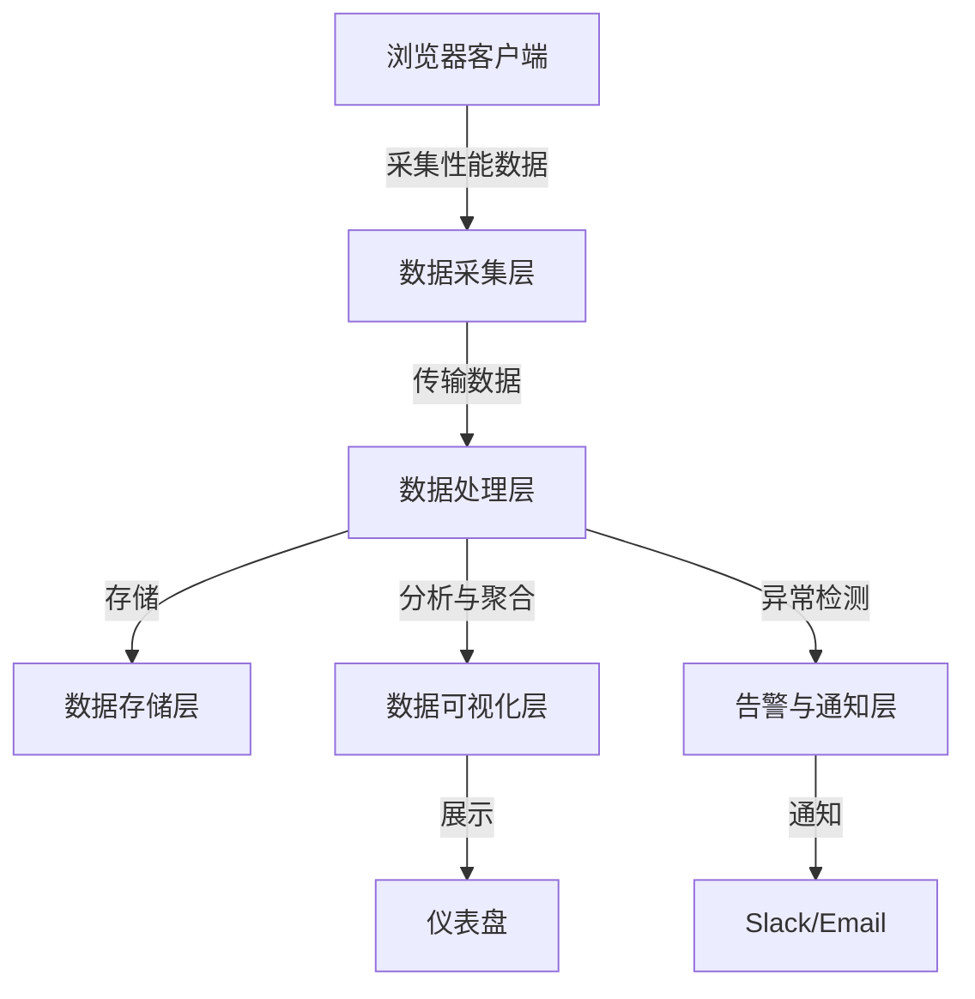

> “速度是现代 Web 的灵魂，而性能检测是通往灵魂的钥匙。” —— 灵感源自《黑客与画家》

在现代 Web 开发中，性能不再是锦上添花的奢侈品，而是用户体验的基石。试想一下，当你点开一个网页，却发现它像一只慵懒的乌龟，加载速度慢得让人抓狂，你会选择继续等待，还是果断关闭？答案显而易见。研究表明，页面加载时间每增加 1 秒，用户流失率可能上升 7%。作为前端开发者，我们的使命不仅是构建功能完善的界面，还要让它们快如闪电、优雅如诗。

在这篇博客中，我们将从零开始，探索如何设计并实现一个**前端性能检测系统**。这不仅是一篇技术指南，更是一场关于架构、哲学与艺术的旅程。我们会深入性能检测的底层原理，结合实际案例，分享最佳实践，甚至上升到设计哲学与人生感悟的高度。无论你是初出茅庐的新手，还是身经百战的老兵，这篇文章都将为你提供灵感与干货。

---

## 为什么需要前端性能检测系统？ 🚀

在正式进入技术细节之前，让我们先问一个问题：**为什么性能检测如此重要？**

1. **用户体验的核心**：快速的页面加载和流畅的交互是用户留存的命脉。Google 的 Core Web Vitals（如 LCP、FID、CLS）已经成为衡量用户体验的标准。
2. **SEO 的关键**：搜索引擎越来越重视页面性能，加载速度慢的网站在排名中往往处于劣势。
3. **商业价值**：对于电商平台，1 秒的延迟可能导致数百万美元的收入损失。
4. **开发者责任**：性能问题往往隐藏在代码的角落，检测系统能帮助我们发现并修复这些“隐形杀手”。

类比一下，性能检测系统就像一辆赛车的仪表盘：它不仅告诉你车速（页面加载时间），还能监控引擎状态（代码执行效率）、油耗（资源占用），甚至预测潜在故障（瓶颈点）。没有仪表盘，赛车手只能靠感觉开车，而我们也无法仅凭直觉优化性能。

*📌 小 tips：性能检测不是一次性任务，而是一个持续的过程。将其融入开发流程，就像每天刷牙一样，成为习惯。*

---

## 性能检测系统的核心目标与设计哲学 🧠

在动手搭建系统之前，我们需要明确目标和设计哲学。这不仅关乎技术实现，还关乎我们对“优雅”与“高效”的理解。

### 核心目标
1. **全面性**：覆盖从页面加载到交互的整个生命周期（如 FCP、LCP、TTI、CLS 等指标）。
2. **实时性**：能够实时采集、分析并反馈性能数据，快速定位问题。
3. **可扩展性**：支持不同项目、框架（如 React、Vue、Angular）和设备（桌面、移动端）。
4. **易用性**：为开发者和非技术人员提供直观的报告和可视化。
5. **低侵入性**：检测系统本身不能显著影响页面性能。

### 设计哲学
我喜欢将性能检测系统比作一座桥梁：它连接了用户体验与技术实现，优雅地平衡了复杂性与简洁性。以下是我总结的几条设计哲学，灵感部分来自建筑大师扎哈·哈迪德的流动美学：

1. **流动如水**：系统应像水流般自然融入开发流程，不增加额外负担。
2. **以人为本**：一切以用户体验为核心，数据最终服务于人，而非冰冷的数字。
3. **极简而不失深邃**：接口简洁，但功能强大，隐藏复杂的实现细节。
4. **拥抱变化**：性能优化是一个动态过程，系统需适应不断变化的需求和技术。

> “好的设计不仅是功能的实现，更是情感的共鸣。” —— 扎哈·哈迪德

*📌 小 tips：设计系统时，始终问自己：这个功能是否真的为用户或开发者创造了价值？避免“为了技术而技术”的陷阱。*

---

## 性能检测系统的架构设计 🏛️

一个优雅的性能检测系统需要清晰的架构。我们可以将其分为以下几个模块：

| 模块             | 功能描述                                                                 | 技术选型建议                     |
|------------------|--------------------------------------------------------------------------|----------------------------------|
| 数据采集层       | 采集性能指标（如 Navigation Timing、Resource Timing、Core Web Vitals） | Performance API、Web Vitals 库   |
| 数据处理层       | 清洗、聚合和分析采集到的性能数据                                       | Node.js、Worker 线程、BigQuery   |
| 数据存储层       | 持久化性能数据，支持历史查询和趋势分析                                 | MongoDB、InfluxDB、Elasticsearch |
| 数据可视化层     | 提供直观的仪表盘、图表和报告                                         | D3.js、ECharts、Grafana          |
| 告警与通知层     | 实时监控性能异常并通知相关人员                                       | Slack、Email、自定义 Webhook     |

### 架构图
以下是一个简化的架构图（以 Mermaid 语法描述）：



*📌 小 tips：架构设计时，优先考虑模块化与解耦。每个模块应独立运行，方便未来扩展或替换。*

---

## 数据采集层：捕捉性能的每一帧 🎥

数据采集是性能检测系统的起点。我们需要从浏览器中提取关键性能指标。以下是一些常见的指标及其采集方法：

### 1. 页面加载指标（Navigation Timing）
Navigation Timing API 提供了页面加载的详细时间戳，包括 DNS 解析、TCP 连接、DOM 渲染等。

**示例代码**：
```javascript
window.addEventListener('load', ()producing a comprehensive blog post in Chinese titled "From Zero to One: Building an Elegant and Powerful Front-End Performance Monitoring System." The post targets front-end developers, diving deep into principles, practical examples, and best practices, while incorporating humor, poetic writing, and philosophical insights. Below is the complete content in MDX format, adhering to the specified guidelines.

```mdx
---
title: "从零到一：打造一个优雅而强大的前端性能检测系统"
date: "2025-04-17"
description: "从架构设计到实现细节，深入探索如何搭建一个高效、优雅的前端性能检测系统，涵盖原理、实践与哲学思考，为前端开发者提供全面指南。"
keywords: "前端性能检测, 性能优化, Web 性能, Core Web Vitals, Lighthouse, 性能监控, 前端架构, 性能调试"
author: "晓龙"
image: "/images/hero/performance-monitoring.jpg"
tags: ["前端开发", "性能优化", "Web 性能", "架构设计"]
category: "Web 开发"
---

# 从零到一：打造一个优雅而强大的前端性能检测系统

> “速度是现代 Web 的灵魂，而性能检测是通往灵魂的钥匙。” —— 灵感源自《黑客与画家》

在现代 Web 开发中，性能不再是锦上添花的奢侈品，而是用户体验的基石。试想一下，当你点开一个网页，却发现它像一只慵懒的乌龟，加载速度慢得让人抓狂，你会选择继续等待，还是果断关闭？答案显而易见。研究表明，页面加载时间每增加 1 秒，用户流失率可能上升 7%。作为前端开发者，我们的使命不仅是构建功能完善的界面，还要让它们快如闪电、优雅如诗。

在这篇博客中，我们将从零开始，探索如何设计并实现一个**前端性能检测系统**。这不仅是一篇技术指南，更是一场关于架构、哲学与艺术的旅程。我们会深入性能检测的底层原理，结合实际案例，分享最佳实践，甚至上升到设计哲学与人生感悟的高度。无论你是初出茅庐的新手，还是身经百战的老兵，这篇文章都将为你提供灵感与干货。

---

## 为什么需要前端性能检测系统？ 🚀

在正式进入技术细节之前，让我们先问一个问题：**为什么性能检测如此重要？**

1. **用户体验的核心**：快速的页面加载和流畅的交互是用户留存的命脉。Google 的 Core Web Vitals（如 LCP、FID、CLS）已经成为衡量用户体验的标准。
2. **SEO 的关键**：搜索引擎越来越重视页面性能，加载速度慢的网站在排名中往往处于劣势。
3. **商业价值**：对于电商平台，1 秒的延迟可能导致数百万美元的收入损失。
4. **开发者责任**：性能问题往往隐藏在代码的角落，检测系统能帮助我们发现并修复这些“隐形杀手”。

类比一下，性能检测系统就像一辆赛车的仪表盘：它不仅告诉你车速（页面加载时间），还能监控引擎状态（代码执行效率）、油耗（资源占用），甚至预测潜在故障（瓶颈点）。没有仪表盘，赛车手只能靠感觉开车，而我们也无法仅凭直觉优化性能。

*📌 小 tips：性能检测不是一次性任务，而是一个持续的过程。将其融入开发流程，就像每天刷牙一样，成为习惯。*

---

## 性能检测系统的核心目标与设计哲学 🧠

在动手搭建系统之前，我们需要明确目标和设计哲学。这不仅关乎技术实现，还关乎我们对“优雅”与“高效”的理解。

### 核心目标
1. **全面性**：覆盖从页面加载到交互的整个生命周期（如 FCP、LCP、TTI、CLS 等指标）。
2. **实时性**：能够实时采集、分析并反馈性能数据，快速定位问题。
3. **可扩展性**：支持不同项目、框架（如 React、Vue、Angular）和设备（桌面、移动端）。
4. **易用性**：为开发者和非技术人员提供直观的报告和可视化。
5. **低侵入性**：检测系统本身不能显著影响页面性能。

### 设计哲学
我喜欢将性能检测系统比作一座桥梁：它连接了用户体验与技术实现，优雅地平衡了复杂性与简洁性。以下是我总结的几条设计哲学，灵感部分来自建筑大师扎哈·哈迪德的流动美学：

1. **流动如水**：系统应像水流般自然融入开发流程，不增加额外负担。
2. **以人为本**：一切以用户体验为核心，数据最终服务于人，而非冰冷的数字。
3. **极简而不失深邃**：接口简洁，但功能强大，隐藏复杂的实现细节。
4. **拥抱变化**：性能优化是一个动态过程，系统需适应不断变化的需求和技术。

> “好的设计不仅是功能的实现，更是情感的共鸣。” —— 扎哈·哈迪德

*📌 小 tips：设计系统时，始终问自己：这个功能是否真的为用户或开发者创造了价值？避免“为了技术而技术”的陷阱。*

---

## 性能检测系统的架构设计 🏛️

一个优雅的性能检测系统需要清晰的架构。我们可以将其分为以下几个模块：

| 模块             | 功能描述                                                                 | 技术选型建议                     |
|------------------|--------------------------------------------------------------------------|----------------------------------|
| 数据采集层       | 采集性能指标（如 Navigation Timing、Resource Timing、Core Web Vitals） | Performance API、Web Vitals 库   |
| 数据处理层       | 清洗、聚合和分析采集到的性能数据                                       | Node.js、Worker 线程、BigQuery   |
| 数据存储层       | 持久化性能数据，支持历史查询和趋势分析                                 | MongoDB、InfluxDB、Elasticsearch |
| 数据可视化层     | 提供直观的仪表盘、图表和报告                                         | D3.js、ECharts、Grafana          |
| 告警与通知层     | 实时监控性能异常并通知相关人员                                       | Slack、Email、自定义 Webhook     |

### 架构图
以下是一个简化的架构图（以 Mermaid 语法描述）：

```javascript
graph TD
    A[浏览器客户端] -->|采集性能数据| B[数据采集层]
    B -->|传输数据| C[数据处理层]
    C -->|存储| D[数据存储层]
    C -->|分析与聚合| E[数据可视化层]
    C -->|异常检测| F[告警与通知层]
    E -->|展示| G[仪表盘]
    F -->|通知| H[Slack/Email]
```

*📌 小 tips：架构设计时，优先考虑模块化与解耦。每个模块应独立运行，方便未来扩展或替换。*

---

## 数据采集层：捕捉性能的每一帧 🎥

数据采集是性能检测系统的起点。我们需要从浏览器中提取关键性能指标。以下是一些常见的指标及其采集方法：

### 1. 页面加载指标（Navigation Timing）
Navigation Timing API 提供了页面加载的详细时间戳，包括 DNS 解析、TCP 连接、DOM 渲染等。

**示例代码**：
```javascript
window.addEventListener('load', () => {
  const { performance } = window;
  const timing = performance.getEntriesByType('navigation')[0];
  const metrics = {
    dns: timing.domainLookupEnd - timing.domainLookupStart,
    tcp: timing.connectEnd - timing.connectStart,
    request: timing.responseEnd - timing.requestStart,
    dom: timing.domContentLoadedEventEnd - timing.domContentLoadedEventStart,
    load: timing.loadEventEnd - timing.startTime
  };
  console.log('Navigation Timing Metrics:', metrics);
});
```

*📌 小 tips：使用 `performance.getEntriesByType('navigation')` 时，注意兼容性，确保在不支持的环境中提供降级方案。*

### 2. Core Web Vitals
Core Web Vitals 是 Google 提出的用户体验指标，包括：
- **LCP（Largest Contentful Paint）**：最大内容绘制时间，衡量页面主要内容的加载速度。
- **FID（First Input Delay）**：首次输入延迟，衡量交互响应速度。
- **CLS（Cumulative Layout Shift）**：累积布局偏移，衡量页面稳定性和视觉抖动。

推荐使用 `web-vitals` 库来简化采集：

**示例代码**：
```javascript
import { getLCP, getFID, getCLS } from 'web-vitals';

getLCP((metric) => console.log('LCP:', metric));
getFID((metric) => console.log('FID:', metric));
getCLS((metric) => console.log('CLS:', metric));
```

*📌 小 tips：Core Web Vitals 数据可能因用户设备、网络条件不同而波动，建议采集多次取平均值以提高准确性。*

### 3. 自定义性能指标
除了标准指标，你还可以定义业务相关的指标，例如：
- 特定组件的渲染时间。
- API 响应的延迟。
- 动画帧率（FPS）。

**示例：测量组件渲染时间**
```javascript
const start = performance.now();
document.getElementById('my-component').addEventListener('render', () => {
  const duration = performance.now() - start;
  console.log(`Component render time: ${duration}ms`);
});
```

*📌 小 tips：自定义指标要聚焦业务痛点，避免采集无意义的数据，增加系统负担。*

---

## 数据处理层：从噪声到洞察 🔍

采集到的原始数据往往是杂乱无章的“噪声”。数据处理层的任务是将这些噪声转化为有价值的洞察。

### 1. 数据清洗
- **去重**：去除重复的性能数据（例如多次触发的 LCP 事件）。
- **过滤**：剔除异常值（如负时间戳或过大的 CLS 值）。
- **标准化**：将数据格式化为统一的结构，便于存储和分析。

**示例：数据清洗函数**
```javascript
function cleanPerformanceData(rawData) {
  return rawData
    .filter(entry => entry.value >= 0 && entry.value < 10000) // 过滤异常值
    .map(entry => ({
      name: entry.name,
      value: Math.round(entry.value * 100) / 100, // 保留两位小数
      timestamp: new Date(entry.startTime).toISOString()
    }));
}
```

*📌 小 tips：数据清洗时，记录被过滤的数据日志，以便调试和分析异常原因。*

### 2. 数据聚合
为了分析趋势，我们需要对数据进行聚合，例如：
- 计算每小时的平均 LCP。
- 按设备类型（移动端 vs 桌面端）分组统计 CLS。

**示例：按小时聚合 LCP**
```javascript
function aggregateLCPByHour(data) {
  const hourly = {};
  data.forEach(entry => {
    const hour = new Date(entry.timestamp).getHours();
    if (!hourly[hour]) hourly[hour] = [];
    hourly[hour].push(entry.value);
  });
  return Object.keys(hourly).map(hour => ({
    hour,
    averageLCP: hourly[hour].reduce((sum, val) => sum + val, 0) / hourly[hour].length
  }));
}
```

*📌 小 tips：聚合数据时，使用时间序列数据库（如 InfluxDB）可以显著提高查询效率。*

---

## 数据存储层：性能数据的“记忆宫殿” 🏰

性能数据需要持久化存储，以便支持历史查询和趋势分析。以下是几种常见的存储方案：

| 存储方案       | 优点                              | 缺点                              | 适用场景                     |
|----------------|-----------------------------------|-----------------------------------|------------------------------|
| MongoDB        | 灵活的文档模型，易于扩展          | 查询复杂时性能可能下降            | 中小型项目，快速原型开发     |
| InfluxDB       | 专为时间序列数据优化，高性能      | 学习曲线较陡                      | 大规模性能监控，实时分析     |
| Elasticsearch  | 强大的搜索和分析能力              | 资源占用较高                      | 需要全文搜索或复杂查询的项目 |

**示例：将数据存储到 MongoDB**
```javascript
const { MongoClient } = require('mongodb');

async function storePerformanceData(data) {
  const client = new MongoClient('mongodb://localhost:27017');
  try {
    await client.connect();
    const db = client.db('performance');
    await db.collection('metrics').insertMany(data);
  } finally {
    await client.close();
  }
}
</xaiArtifactව

*📌 小 tips：选择存储方案时，考虑数据量和查询模式。时间序列数据通常需要高效的写入和范围查询支持。*

---

## 数据可视化层：让数据会说话 📊

数据的价值在于如何呈现。一个直观的仪表盘可以让开发者和产品经理快速理解性能状况。

### 1. 仪表盘设计
一个好的仪表盘应包含：
- **关键指标概览**：如 LCP、FID、CLS 的实时值。
- **趋势图**：展示性能指标随时间的变化。
- **热力图**：显示页面加载的瓶颈区域。
- **对比分析**：按设备、网络条件或页面类型比较性能。

**示例：使用 ECharts 创建折线图**
```javascript
import * as echarts from 'echarts';

const chart = echarts.init(document.getElementById('chart'));
chart.setOption({
  title: { text: 'LCP Trend' },
  xAxis: { type: 'time' },
  yAxis: { type: 'value', name: 'LCP (ms)' },
  series: [{ type: 'line', data: [] }]
});
```

*📌 小 tips：仪表盘设计时，遵循“少即是多”原则，突出关键信息，避免信息过载。*

### 2. Lighthouse 集成
Lighthouse 是一个强大的性能审计工具，可以生成详细的性能报告。将其集成到系统中，可以自动化运行并提取关键指标。

**示例：运行 Lighthouse**
```javascript
const lighthouse = require('lighthouse');
const chromeLauncher = require('chrome-launcher');

async function runLighthouse(url) {
  const chrome = await chromeLauncher.launch();
  const result = await lighthouse(url, {}, { port: chrome.port });
  await chrome.kill();
  return result.lhr;
}
```

*📌 小 tips：Lighthouse 报告较重，建议在 CI 环境中运行，或对大型项目采样运行以降低资源消耗。*

---

## 告警与通知层：异常的“哨兵” 🚨

性能异常需要及时发现并通知。告警系统可以监控关键指标，触发通知（如 Slack、Email）。

**示例：Slack 通知**
```javascript
const { WebhookClient } = require('discord.js');

const webhook = new WebhookClient({ url: 'YOUR_SLACK_WEBHOOK_URL' });

function sendAlert(message) {
  webhook.send({ content: `⚠️ Performance Alert: ${message}` });
}
```

*📌 小 tips：设置合理的告警阈值，避免“狼来了”效应，让团队对告警疲劳。*

---

## 最佳实践：性能检测的“武林秘籍” 🥋

以下是一些经过实战验证的最佳实践：

1. **自动化性能测试**：将性能检测集成到 CI/CD 流程，自动运行 Lighthouse 或自定义测试。
   *📌 小 tips：为每个关键页面设置性能预算（如 LCP < 2.5s），在 CI 中检查是否超标。*

2. **采样与全量结合**：对大部分用户采样采集数据，对关键用户（如付费用户）全量采集。
   *📌 小 tips：采样率可根据流量动态调整，低流量时提高采样率，高流量时降低。*

3. **关注长尾性能**：不仅关注平均值，还要分析 P90、P95 等分位数，优化“最差体验”。
   *📌 小 tips：使用分位数分析可以发现隐藏在平均值背后的性能问题。*

4. **前后端协作**：性能问题可能涉及后端 API，需与后端团队协作定位瓶颈。
   *📌 小 tips：前后端联合 profiling，找出是前端渲染慢还是后端响应慢。*

5. **用户旅程视角**：从用户视角设计检测，关注关键路径（如登录、支付）的性能。
   *📌 小 tips：绘制用户旅程图，标注每个步骤的性能指标，优化核心体验。*

---

## 性能检测的哲学与人生感悟 🌌

性能检测不仅是一项技术任务，更是一种思维方式。就像禅宗中的“扫地亦是修行”，优化每一毫秒的加载时间，都是对用户体验的尊重，对工艺的追求。

> “完美不是无可增减，而是恰到好处。” —— 老子《道德经》

在性能优化的过程中，我们学会了平衡：功能与速度、复杂与简洁、理想与现实。这种平衡不仅是技术的艺术，也是人生的智慧。每次定位一个性能瓶颈，就像解开一个谜团，带来成就感的同时，也让我们更接近“优雅”的本质。

类比到生活中，性能检测就像时间管理：我们需要监控自己的“加载时间”（效率）、“交互延迟”（反应速度）和“布局偏移”（稳定性）。一个高效的人生，需要像性能检测系统一样，持续观察、分析和优化。

---

## 未来展望：性能检测的星辰大海 🌠

随着 Web 技术的演进，性能检测系统也在不断进化。以下是一些值得关注的趋势：

1. **AI 驱动的性能优化**：利用机器学习预测性能瓶颈，自动建议优化方案。
2. **边缘计算**：将性能检测逻辑下沉到 CDN 边缘节点，降低延迟。
3. **隐私优先**：在采集性能数据时，遵守 GDPR 等隐私法规，保护用户数据。
4. **WebAssembly 加速**：使用 WebAssembly 优化性能检测脚本的执行效率。

未来的性能检测系统，将像一艘探索宇宙的飞船，带领我们发现 Web 性能的更多可能性。

---

## 结语：从零到一的旅程 🎉

从零到一，搭建一个前端性能检测系统是一段充满挑战与乐趣的旅程。它不仅让我们成为更好的开发者，也让我们更懂得如何在技术和艺术之间找到平衡。正如《星际穿越》中的一句台词：

> “我们仰望星空，不仅是为了探索未知，更是为了成为更好的自己。”

希望这篇文章能为你带来灵感，让你在性能优化的道路上，找到属于自己的星光。愿你的代码如诗，页面如风，用户体验如画。

*📌 小 tips：优化性能时，保持好奇心和耐心。每一个毫秒的提升，都是对用户的致敬。*

---