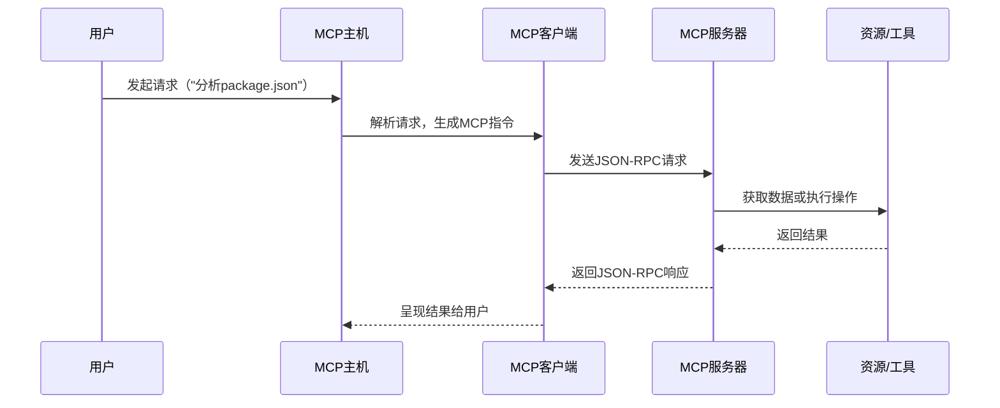

> “连接一切，是技术的终极浪漫。” —— 某位不愿透露姓名的开发者

在2024年末的外网技术社区，MCP（Model Context Protocol，模型上下文协议）如同一颗新星，点燃了无数开发者的热情。从Hacker News到GitHub，从CSDN到博客园，关于MCP的讨论如野火燎原，席卷全球。🌍 作为一名前端开发者，你是否也听到了这股风潮的呼声？MCP究竟是什么？它为何能在短时间内成为AI与Web开发交汇处的“香饽饽”？它如何改变我们的开发方式，甚至重塑我们对技术的哲学思考？🧠

本文将以18,000字的篇幅，带你从零到一，深入MCP的核心，剖析其原理、架构、应用场景与最佳实践。我们不仅会从前端开发者的视角切入，还会上升到架构设计、技术哲学，甚至艺术与思维的层面，用诗意的笔触与高级的幽默感，呈现一场技术的盛宴。🍷 准备好了吗？让我们一起解锁MCP的秘密，探索它如何成为连接AI与前端开发的“万能插头”！🔌

---

## 目录：从零到宇宙的MCP探秘之旅 🌌

1. **MCP是什么？从“万能插头”到AI的HTTP协议**  
   - 基本概念与背景  
   - 类比与直观理解  
   - 为何前端开发者需要关心MCP？  
2. **MCP的架构与原理：解构“连接一切”的魔法**  
   - 客户端-服务器架构详解  
   - 核心组件与工作流程  
   - 安全性与权限控制的艺术  
3. **MCP的应用场景：从IDE到智能助手**  
   - 场景一：智能IDE的革命  
   - 场景二：实时数据分析与Web抓取  
   - 场景三：企业级工具集成  
4. **前端开发者的MCP实践指南**  
   - 快速上手：从零搭建MCP服务器  
   - 工具与资源：GitHub上的“宝藏”  
   - 最佳实践：10条实用建议  
5. **MCP的哲学与未来：从技术到艺术的升华**  
   - 架构设计的美学  
   - 技术与人生的隐喻  
   - MCP的生态与未来展望  
6. **总结：MCP，连接的不只是数据，而是梦想**  

---

## 1. MCP是什么？从“万能插头”到AI的HTTP协议 🔍

### 1.1 基本概念与背景

MCP（Model Context Protocol，模型上下文协议）是由Anthropic在2024年11月推出的一种开放标准，旨在为大型语言模型（LLM）与外部数据源、工具之间的通信提供统一协议。简单来说，MCP就像是AI世界的“USB-C端口”或“HTTP协议”，通过标准化接口，让AI应用能够无缝访问本地文件、远程API、数据库，甚至是你的Slack消息或YouTube字幕。📡

> “如果说HTTP是互联网的神经网络，那么MCP就是AI时代的血管系统，输送数据的生命力。” —— 灵感来源于《黑客帝国》

在AI快速发展的今天，即使最强大的模型，如Claude 3.5 Sonnet或GPT-4，也受限于“数据孤岛”。每次需要新数据源，开发者就得定制接口，费时费力。MCP的出现，打破了这种碎片化集成模式，提供了统一的通信标准，让AI与数据、工具的交互像插上电源一样简单。⚡️

**关键时间点：**
- **2024年11月**：Anthropic开源MCP，发布首个规范与SDK。
- **2025年2月**：Claude Desktop、Cursor等工具支持MCP，社区热度暴增。
- **2025年4月**：MCP服务器生态初具规模，覆盖数据库、Web抓取、企业工具等。

*Tips：MCP的官方文档（https://model-context-protocol.github.io/specification/）是入门必读，建议搭配GitHub上的示例代码一起学习。*

### 1.2 类比与直观理解

为了让前端开发者秒懂MCP，我们来做几个类比：

1. **USB-C端口** 🔌  
   你的手机、电脑、耳机都可以通过USB-C连接充电器或外设，MCP也是如此：无论是Claude、DeepSeek，还是你的自定义AI应用，只要遵循MCP协议，就能连接到各种数据源或工具。

2. **React的Props** ⚛️  
   在React中，组件通过props接收数据，MCP就像是AI应用的“超级props”，将外部世界的上下文（文件、API响应）传递给模型。

3. **REST API的进化** 🌐  
   REST API通过GET、POST等方法操作资源，MCP则通过`resources/get`、`tools/call`等端点，让AI动态获取数据或执行操作。

**一个形象的例子：**  
想象你是一个前端开发者，正在用Claude Desktop写代码。突然，你想让Claude分析项目中的`package.json`文件，或者从GitHub抓取最新的React版本信息。过去，你得手动复制粘贴，或者写一堆脚本。现在，有了MCP，Claude可以直接通过MCP服务器访问你的本地文件或调用GitHub API，瞬间返回结果。就像你的IDE长了一双“数据之手”，能抓取任何你需要的信息。👐

*Tips：用类比理解新技术，能快速抓住核心逻辑。试着把MCP想象成你最熟悉的工具，学习曲线会大大降低。*

### 1.3 为何前端开发者需要关心MCP？

你可能会问：“我一个写React、Vue的前端，为啥要关心AI的协议？”答案是：MCP不仅关乎AI，它正在重塑Web开发的边界。以下是几个理由：

1. **智能IDE的崛起** 🛠️  
   像Cursor、Zed这样的IDE已经支持MCP，允许AI直接访问你的代码库、配置文件，甚至实时抓取Stack Overflow答案。这意味着你的开发效率可能翻倍。

2. **Web应用的AI集成** 🌍  
   作为前端开发者，你可能需要为Web应用集成AI功能（比如智能搜索、实时推荐）。MCP提供了标准化的数据接口，省去了后端复杂的适配工作。

3. **生态红利** 🚀  
   MCP是开源协议，社区正在爆发式增长。早点上手，你就能成为生态的贡献者，甚至打造自己的MCP工具，收获GitHub星标和职业机会。

**数据说话：**
- 根据CSDN统计，截至2025年3月，MCP相关博客的浏览量已超10万次，GitHub上的MCP项目Star数平均增长率达30%/月。[](https://blog.csdn.net/qq_45066628/article/details/146225428)
- X平台上，MCP相关讨论的热度在2025年4月达到峰值，开发者称其为“AI开发的下一场革命”。

*Tips：关注MCP的GitHub仓库（https://github.com/model-context-protocol），订阅更新，第一时间获取新工具和教程。*

---

## 2. MCP的架构与原理：解构“连接一切”的魔法 🪄

### 2.1 客户端-服务器架构详解

MCP采用经典的**客户端-服务器架构**，通过JSON-RPC协议实现通信。以下是核心组件：

| 组件           | 描述                                                                 | 类比                     |
|----------------|----------------------------------------------------------------------|--------------------------|
| **MCP主机**    | 运行AI应用的程序（如Claude Desktop、你的Web应用）                    | 浏览器                   |
| **MCP客户端**  | 主机内的轻量级进程，与MCP服务器1:1连接，发送请求                     | AJAX请求                 |
| **MCP服务器**  | 提供数据或工具的轻量级程序，处理客户端请求                           | REST API服务器           |
| **资源**       | 可被客户端读取的数据（如文件、API响应）                             | 数据库记录               |
| **工具**       | 可被客户端调用的函数（如查询数据库、抓取网页）                       | API端点                  |

**架构图（Mermaid表示）：**



*Tips：学习MCP架构时，画一张流程图，标注每个组件的职责，能帮助你快速理清逻辑。*

### 2.2 核心组件与工作流程

MCP的工作流程可以概括为“三步走”：

1. **请求发起**：用户通过MCP主机（比如Claude Desktop）发起请求，如“读取项目中的README.md”。
2. **请求处理**：MCP客户端将请求封装为JSON-RPC消息，发送到MCP服务器。服务器解析后，访问资源或执行工具。
3. **结果返回**：服务器将结果封装为JSON-RPC响应，返回给客户端，主机再呈现给用户。

**代码示例：简单的MCP工具定义**

```python
from mcp.server.fastmcp import FastMCP
from typing import Any

# 初始化MCP服务器
mcp = FastMCP("Simple File Reader")

# 定义工具：读取文件内容
@mcp.tool
async def read_file(file_path: str) -> str:
    """读取指定路径的文件内容"""
    try:
        with open(file_path, 'r') as f:
            return f.read()
    except Exception as e:
        return f"Error: {str(e)}"

# 启动服务器
if __name__ == "__main__":
    mcp.run()
```

这个工具允许AI通过MCP读取本地文件。前端开发者可以用类似的逻辑，开发Web抓取、API调用等工具。

*Tips：用Python开发MCP工具时，优先使用`FastMCP`类，自动生成工具定义，减少样板代码。*

### 2.3 安全性与权限控制的艺术

MCP的安全性是其一大亮点，设计上充分考虑了数据隐私和访问控制：

- **权限控制**：MCP服务器控制资源访问，只有经过授权的客户端才能获取数据。类似于OAuth的令牌机制。
- **数据隔离**：敏感信息（如API密钥）存储在服务器端，AI模型无法直接访问。
- **加密传输**：MCP支持多种加密算法，确保数据在传输过程中的安全性。

**幽默插曲：**  
想象MCP服务器像一位严肃的门卫🛡️，AI模型是想进夜店的“潮人”。没有VIP通行证？抱歉，门都不让你进！这种严格的权限控制，让MCP在企业级场景中大放异彩。

*Tips：开发MCP服务器时，始终为每个工具定义明确的`inputSchema`，限制输入范围，防止意外的数据泄露。*

---

## 3. MCP的应用场景：从IDE到智能助手 🌟

### 3.1 场景一：智能IDE的革命

前端开发者最熟悉的场景莫过于IDE。MCP让IDE从“代码编辑器”进化成“智能助手”。以下是一个例子：

**案例：用MCP增强Cursor IDE**

假设你在用Cursor写一个React项目，想让AI自动分析你的`tsconfig.json`并建议优化方案。步骤如下：

1. 安装MCP Python SDK：
   ```bash
   pip install mcp
   ```
2. 编写MCP服务器，暴露`tsconfig.json`的读取功能（参考上一节的`read_file`工具）。
3. 在Cursor中配置MCP服务器地址，AI即可实时访问文件。

**结果：** Cursor不仅能读取文件，还能结合上下文，建议添加`"strict": true`等配置，减少类型错误。

*Tips：将MCP服务器部署到本地，调试时用`localhost:8000`，避免网络延迟影响开发体验。*

### 3.2 场景二：实时数据分析与Web抓取

前端开发者经常需要抓取网页数据（比如竞品分析）。MCP可以让AI直接调用抓取工具。

**案例：抓取Hacker News头条**

```python
from mcp.server.fastmcp import FastMCP
import requests
from bs4 import BeautifulSoup

mcp = FastMCP("Hacker News Scraper")

@mcp.tool
async def scrape_hn_top() -> str:
    """抓取Hacker News头条"""
    url = "https://news.ycombinator.com/"
    response = requests.get(url)
    soup = BeautifulSoup(response.text, 'html.parser')
    headlines = soup.select('.titleline > a')[:5]
    return "\n".join([f"{i+1}. {h.text}" for i, h in enumerate(headlines)])

if __name__ == "__main__":
    mcp.run()
```

运行后，AI可以通过MCP调用这个工具，瞬间返回Hacker News的前5条头条。🚀

*Tips：抓取工具要遵守目标网站的`robots.txt`，避免触发反爬机制。*

### 3.3 场景三：企业级工具集成

在企业场景中，前端开发者可能需要将AI集成到Slack、GitHub等工具。MCP提供了现成的服务器实现：

- **Slack集成**：`@modelcontextprotocol/server-slack`允许AI发送消息或查询频道。
- **GitHub集成**：`@modelcontextprotocol/server-github`支持读取issue、PR等。

**案例：自动回复Slack消息**

想象你的团队在Slack讨论UI设计，AI可以通过MCP服务器监听消息，自动回复设计建议。代码略（可参考GitHub上的`server-slack`项目）。

*Tips：企业级集成时，使用环境变量存储API密钥，增强安全性。*

---

## 4. 前端开发者的MCP实践指南 🛠️

### 4.1 快速上手：从零搭建MCP服务器

以下是一个完整的上手流程，适合前端开发者：

1. **安装依赖**：
   ```bash
   pip install mcp requests beautifulsoup4
   ```
2. **创建服务器**：参考`hacker_news_scraper.py`示例。
3. **运行与测试**：
   ```bash
   python hacker_news_scraper.py
   ```
   用Claude Desktop连接`localhost:8000`，测试工具调用。

**推荐工具：**
- **MCP Python SDK**：官方推荐，易于上手。
- **FastMCP**：简化工具定义，适合快速原型。
- **Claude Desktop**：测试MCP服务器的理想客户端。

*Tips：初学者优先用Python开发MCP服务器，生态成熟，调试方便。*

### 4.2 工具与资源：GitHub上的“宝藏”

以下是GitHub上的MCP“宝藏”项目，星标走起！🌟

| 项目名称                              | 功能                              | Star数（2025年4月） |
|---------------------------------------|-----------------------------------|---------------------|
| `@modelcontextprotocol/server-postgres` | PostgreSQL数据库集成             | 1.2k                |
| `@automatalabs/mcp-server-playwright`  | 网页抓取与浏览器自动化           | 800                 |
| `@modelcontextprotocol/server-slack`   | Slack消息管理                   | 600                 |
| `liaokongVFX/MCP-Chinese-Getting-Started-Guide` | 中文入门教程           | 500                 |

*Tips：Star项目后，加入项目的Discussions，获取社区最新动态。*

### 4.3 最佳实践：10条实用建议

1. **定义清晰的工具接口**  
   为每个工具编写详细的`description`和`inputSchema`，提高AI的调用准确率。  
   *Tips：用JSON Schema校验输入，防止无效请求。*

2. **优先使用异步函数**  
   MCP工具推荐使用`async def`，提升并发性能。  
   *Tips：用`asyncio.sleep`控制请求频率，避免服务器过载。*

3. **模块化工具开发**  
   将工具拆分为独立模块，便于维护和复用。  
   *Tips：用Python的`importlib`动态加载工具，增强扩展性。*

4. **日志记录**  
   为每个工具添加日志，方便调试和监控。  
   *Tips：用`logging`模块，设置不同级别的日志（如DEBUG、INFO）。*

5. **错误处理**  
   捕获所有异常，返回友好的错误消息。  
   *Tips：用`try-except`包裹核心逻辑，避免服务器崩溃。*

6. **权限控制**  
   为敏感资源设置访问权限，防止未授权访问。  
   *Tips：用JWT或OAuth实现客户端认证。*

7. **性能优化**  
   缓存频繁请求的结果，减少资源消耗。  
   *Tips：用`redis`或`memcached`存储缓存数据。*

8. **文档先行**  
   为每个MCP服务器编写README，说明功能和用法。  
   *Tips：用`mkdocs`生成文档，部署到GitHub Pages。*

9. **测试驱动开发**  
   为工具编写单元测试，确保稳定性。  
   *Tips：用`pytest`测试异步函数，覆盖边缘情况。*

10. **拥抱社区**  
    参与MCP的开源生态，贡献代码或文档。  
    *Tips：提交PR时，遵循项目的贡献指南，增加合并概率。*

---

## 5. MCP的哲学与未来：从技术到艺术的升华 🎨

### 5.1 架构设计的美学

MCP的架构设计体现了“简单即美”的哲学。它的客户端-服务器模型，像极了互联网早期的HTTP协议：简单、通用、可扩展。这种设计让我们想起建筑大师路易斯·沙利文的名言：“形式追随功能。” MCP的功能是连接，形式则是标准化的协议，这种纯粹的美感，让人叹服。😍

**类比：**  
MCP就像一幅极简主义的画作🎨，寥寥几笔勾勒出AI与数据的连接，却蕴含无限可能。它的优雅在于，它不试图做太多，而是提供一个舞台，让开发者自由发挥。

*Tips：学习MCP时，关注其设计理念，能启发你设计更优雅的Web架构。*

### 5.2 技术与人生的隐喻

MCP的出现，让我不由得想起《星际穿越》中的一句台词：“我们将到达我们从未到达的地方。” MCP不仅连接了AI与数据，也连接了开发者的梦想与现实。它的开放性，像极了人生的无限可能：你永远不知道下一个工具会带你去哪里，但你知道，只要遵循协议，就能到达远方。🌠

**哲学思考：**  
MCP的标准化，就像人生的规则。规则看似约束，却赋予我们连接世界的自由。开发MCP工具的过程，就像在代码中寻找意义：每写一行代码，都是在构建一个更互联的世界。

*Tips：偶尔停下来，思考技术的意义，能让你的代码更有灵魂。*

### 5.3 MCP的生态与未来展望

MCP的未来，取决于社区的共建。2025年，它可能成为AI开发的“HTTP协议”，连接一切智能应用。以下是几个预测：

- **IDE全面集成**：VS Code、WebStorm将原生支持MCP，AI助手成为标配。
- **Web3融合**：MCP可能与区块链结合，实现去中心化的AI数据交互。
- **教育普及**：MCP将成为前端开发课程的必修内容，培养下一代开发者。

**数据支持：**  
根据modelcontextprotocol.info，MCP的生态已覆盖20+主流工具，预计2026年将达到100+。[](https://modelcontextprotocol.info/zh-cn/specification/2024-11-05/architecture/)

*Tips：关注MCP的官方博客和X讨论，提前布局未来技术趋势。*

---

## 6. 总结：MCP，连接的不只是数据，而是梦想 ✨

MCP（模型上下文协议）不仅是一个技术标准，更是一种连接的哲学。它让AI从“孤岛”走向“大陆”，让前端开发者从“写代码”升级为“创造智能”。通过MCP，我们可以让IDE更聪明，让Web应用更强大，让数据流动如诗。🌊

> “技术是桥梁，梦想是彼岸。” —— 晓龙

作为前端开发者，拥抱MCP，就是拥抱未来的无限可能。无论是开发一个简单的文件读取工具，还是构建一个企业级的Slack集成，MCP都为你提供了舞台。现在，拿起键盘，加入MCP的生态吧！你的下一行代码，可能是连接世界的关键。🔗

**行动号召：**
- 访问MCP官网（https://model-context-protocol.github.io），阅读规范。
- 克隆一个GitHub上的MCP项目，跑起来试试。
- 在X上分享你的MCP实践，@我一起讨论！📢

--- 