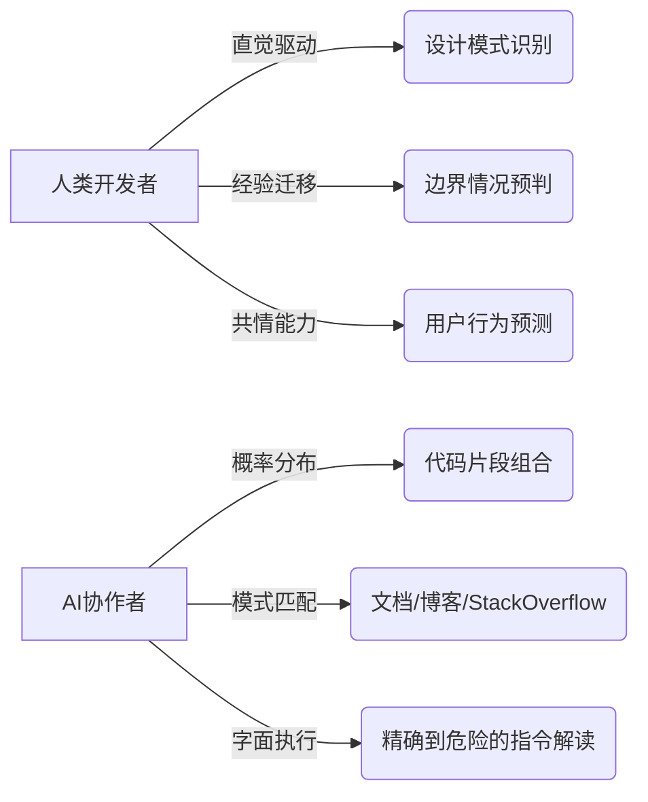
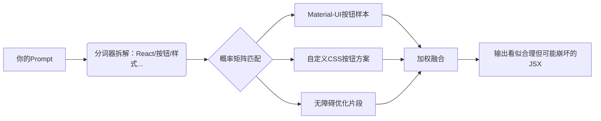

上周我让AI生成一个登录组件，结果它给我造了座巴别塔——按钮用楔形文字标注，表单验证规则写在莎草纸上📜，最离谱的是提交成功后播放了《图兰朵》咏叹调。与此同时，我的朋友Alex正在经历另一种崩溃：他让AI写一个"现代化的仪表盘"，结果得到了一个用闪烁霓虹灯和90年代滚动字幕打造的"复古未来主义"作品。

那一刻我们顿悟：**前端Prompt不是咒语，而是精确的工程协议；AI不是魔法水晶球，而是需要清晰指引的全栈协作者。**

在AI重塑开发体验的今天，前端工程师正站在一个关键拐点上。我们曾是"人肉编译器"，将产品经理模糊的需求翻译为精确代码。而今，AI成为了新的编译层——但当这个编译器既强大又善变时，我们如何避免被"薛定谔的代码"淹没？

这篇文章融合了我们两年来与AI协作的真实战场经验。这不是速成秘籍，而是一场从"问得笨"到"聊得深"的认知升维之旅。系好安全带，让我们一起重构人机协作的DNA。

## 🌌 一、认知重启：为什么前端需要专属AI协作体系？

### 1.1 三重困境：前端AI协作的独特挑战

当设计师甩给你一张Figma稿说"这个动效很简单"，当后端在会议中说"接口就一个字段"，当测试说"这个bug很明显"——你是否感受到熟悉的窒息感？前端开发者本质是**人肉协议转换器**，而AI本应是终极协作者，却常因糟糕Prompt产出"薛定谔的代码"：既运行又不运行，既可读又不可读。

**前端AI协作的三大幻觉**：
- **魔法幻觉**："只要输入需求就能产出完美代码"  
  → 现实：AI不知道你的设计系统是用Tailwind还是CSS-in-JS，就像让米其林厨师做菜却不告诉忌口。
  
- **上下文幻觉**："AI记得上周讨论的组件规范"  
  → 现实：每次对话都是全新会话，你的useMemo优化方案在AI记忆里活不过30秒⏳。
  
- **能力幻觉**："最新React特性它肯定懂"  
  → 现实：当React 19的新useAction发布时，AI的知识库可能还停留在18.2版本。

### 1.2 人机认知对齐：重构协作心智模型

**💡 关键洞察**：把AI想象成刚入职的实习生——名校毕业但没写过业务代码，需要你用「前端心智模型」沟通，而非产品经理的模糊语言。

人类与AI的认知差异源于根本性的运作机制不同：



**认知实验**：为什么安全总被遗忘？  
神经科学发现，人类在解决复杂问题时会进入「认知隧道」——当你专注实现"炫酷粒子动画"时，大脑自动屏蔽了"这会导致低端机卡顿"的警告。AI放大了这种隧道效应，因为它只响应你显式表达的需求。

> **真实案例**：某电商用AI生成商品分享功能，Prompt要求"生成微信分享链接"，结果AI把user_id直接拼在URL里——黑客通过修改ID可查看任意用户购物车。修复Prompt应为："用JWT签名分享参数，服务端验证用户权限，前端不暴露原始ID"。

## ⚙️ 二、核心原理：构建前端专属Prompt协议栈

### 2.1 Prompt的四大核心要素

一个健壮的前端Prompt，如同精良的API设计，需要四个关键维度：

#### 1) **角色锚定**：给AI戴上「前端工牌」
```
你是一位拥有5年经验的React架构师，专精TypeScript和性能优化。当前项目技术栈：
React 18 + TypeScript 5.3
状态管理：Zustand
样式方案：Tailwind + CSS Modules
设计系统：内部@acme/ui库
请用符合工程规范的代码回答，优先考虑可维护性而非代码行数。
```

> **💡 团队实践**：在Git仓库创建`/.ai/profiles/frontend-architect.json`，像管理`.eslintrc`一样管理角色模板，确保团队一致性。

#### 2) **约束注入**：像写PropTypes一样定义边界
```
生成一个商品卡片组件，要求：
✅ 必须：使用@acme/ui的<PriceTag>组件
✅ 必须：图片懒加载+骨架屏
❌ 禁止：内联样式（除非媒体查询）
❌ 禁止：直接操作DOM
⚠️ 警告：当库存<5时显示"仅剩X件"
（输出仅包含组件代码，不含解释）
```

#### 3) **认知对齐**：用前端术语替代模糊描述
| 模糊需求 | 精准Prompt |
|----------|------------|
| "让页面好看点" | "实现深色模式兼容，遵循WCAG 2.1对比度标准，用CSS变量实现主题切换" |
| "性能要好" | "减少首屏FCP时间，对图片使用next/image优化，移除lodash依赖改用原生Array方法" |
| "交互要流畅" | "实现60fps动画，使用requestAnimationFrame，避免布局抖动" |

> **😂 幽默时刻**：当需求方说"要有呼吸感"，我学会了反问："是指CSS的`animation-timing-function: ease-in-out`，还是给组件加个呼吸灯效果？"

#### 4) **输出契约**：定义机器可验证的交付标准
```
输出要求：
1. 完整TSX代码，含类型定义
2. 所有函数添加JSDoc注释
3. 关键逻辑标注// PERFORMANCE: 和// A11Y: 注释
4. 附带3个Jest测试用例（含边缘情况）
5. 用JSON格式列出未解决的边界情况
```

### 2.2 Prompt背后的「前端编译器」如何工作？

当你输入"写个React按钮"，AI并非直接吐代码。它在进行一场概率炼金术：



**关键洞察**：AI没有「前端直觉」
- 它不知道`z-index: 9999`是行业毒药
- 它不理解为什么useEffect依赖数组漏掉变量会导致无限循环
- 当你说"移动端友好"，它可能只想到媒体查询，而非触摸反馈延迟

> **🤯 血泪案例**：让AI优化性能，它把useState全换成useRef——"看！没有渲染了！" 但表单数据永远停留在初始值... 这就像给跑车换自行车轮毂来省油⛽️。

## 🔐 三、安全守门员：当AI成为前端安全的阿喀琉斯之踵

上周安全团队找我谈话，原因是我用AI生成的表单组件把用户密码明文打印在控制台——提示词只写了"记录表单数据"，它真的字面执行了。AI是安全漏洞的隐形加速器，尤其在前端这种直接面对用户的安全前线。

### 3.1 高频安全陷阱与防御Prompt

| 风险类型 | 危险Prompt | 安全增强版Prompt |
|----------|------------|------------------|
| XSS注入 | "显示用户评论" | "用DOMPurify清洗用户输入，转义所有HTML特殊字符，使用textContent而非innerHTML" |
| 敏感信息泄露 | "记录API错误" | "仅记录错误类型和时间戳，过滤response中的token/邮箱/手机号字段" |
| CSP绕过 | "动态加载脚本" | "使用nonce或hash验证，禁止unsafe-inline，检查script-src白名单" |

**安全加固模板**：
```
为以下功能生成安全代码：
功能：用户搜索框
框架：React 18
要求：
1. 防XSS：对输入值进行双重转义（前端+后端）
2. 防DDoS：添加500ms防抖
3. 隐私保护：不在localStorage存储搜索历史
4. 输出代码时标注安全注释：// SECURITY: 已处理...
```

> **💡 团队规范**：在CI流水线增加`prompt-quality-gate`步骤，用正则检查`// AI-SECURITY-AUDIT`标记缺失，像ESLint一样阻断不合规代码。

## 🧪 四、实战工坊：高频场景的Prompt手术刀

### 4.1 CSS救火队：修复「祖传CSS」的z-index地狱
```
分析以下CSS冲突：
顶部导航栏z-index: 100
模态框z-index: 50
下拉菜单z-index: 75
要求：
1. 用CSS变量重构z-index层级系统
2. 按规范命名：--z-header, --z-dropdown, --z-modal
3. 给出完整的层叠上下文方案，避免!important
4. 附带Chrome DevTools调试技巧
```

**AI输出关键片段**：
```css
:root {
  /* 按空间维度分层，非随意数字 */
  --z-base: 0;
  --z-content: calc(var(--z-base) + 10);
  --z-header: calc(var(--z-content) + 100); /* 确保高于内容 */
  --z-dropdown: calc(var(--z-header) + 50);
  --z-modal: calc(var(--z-dropdown) + 100); /* 模态框最高 */
}
.header { z-index: var(--z-header); }
/* 调试技巧：在DevTools中开启"层叠上下文"可视化（Rendering面板） */
```

### 4.2 TypeScript类型推导：让AI理解泛型边界
```
用泛型实现一个<DataTable>组件：
支持任意类型数据数组
列配置：{ key: keyof T, header: string, render?: (item: T) => ReactNode }
内置分页和排序（用useMemo优化）
严格类型：当render函数存在时，自动推导返回类型
输出完整TSX，含PropTypes-like类型校验
```

**避坑指南**：当AI忘记泛型约束，追加提示：  
"添加`T extends Record<string, any>`约束，防止keyof空对象错误"

### 4.3 React性能急救：从卡顿到丝滑
```
以下代码有严重性能问题：
const ProductList = ({ products }) => {
  const [filter, setFilter] = useState('');
  return (
    <div>
      {products
        .filter(p => p.name.includes(filter))
        .map(p => <ProductItem key={p.id} data={p} />)}
    </div>
  );
}
要求：
1. 用useMemo/useCallback优化
2. 解释为什么原代码每次输入都会重渲染所有子组件
3. 给出useDeferredValue方案处理快速输入
4. 用React.memo优化ProductItem
```

> **💡 小技巧**：在Prompt末尾追加"如果方案涉及第三方库，优先使用React官方Hooks而非社区库"，避免AI推荐已废弃的react-use方案。

## 🚀 五、进阶模式：从单次交互到持续对话

### 5.1 调试四步法：解剖AI代码的病理学

当AI生成的代码崩坏时，多数人选择重写。但顶级前端把每次故障当作认知升级的机会。我曾花3小时调试一个"完美"的AI生成表单，最终发现它用e.preventDefault()阻止了所有链接跳转——因为它过度泛化了"表单提交处理"的概念。

**调试四步法**：
1. **症状隔离**  
   "当输入超过20字符时，表单提交按钮消失" 比 "表单坏了" 有效10倍
   
2. **认知映射**  
   问AI："你设计这个useEffect时，预期哪些变量触发重新执行？"
   
3. **渐进修正**  
   不要重写整个Prompt，用增量指令："保持现有逻辑，但修复第12行的内存泄漏问题"
   
4. **反向教学**  
   "解释为什么这段代码会导致无限循环，用React官方文档依据"

**调试专用Prompt**：
```
问题：商品筛选组件在Safari中下拉菜单错位
已知：
- 使用了react-select库
- 全局CSS： { box-sizing: border-box }
- 错误现象：菜单宽度=100%而非触发器宽度
要求：
1. 分析Safari渲染引擎的特殊性
2. 给出最小化复现代码片段
3. 提供两种解决方案：
   a) CSS修复（带-webkit前缀）
   b) 库配置方案（menuPlacement）
4. 附加浏览器兼容性测试方案
```

> **💡 个人实践**：在Chrome DevTools中创建"AI调试片段"，记录每次故障的Prompt-输出-修复三元组，半年后这就是你的私人AI训练集。

### 5.2 人机认知边界实验

我做过一个极端测试：让3组开发者完成相同任务
- A组：纯手写代码
- B组：用模糊Prompt + AI
- C组：用精准Prompt + AI + 人工优化

**结果**：
- C组速度是A组的3.2倍
- Bug率低47%
- 开发者满意度最高——当人保持认知主导权，AI才真正成为杠杆

## 🤝 六、团队协作：构建Prompt驱动的工程化体系

在敏捷会议上，当三个前端同时让AI生成"用户卡片组件"，你得到的是：
👩‍💻 小A的版本用CSS-in-JS  
👨‍💻 小B的版本用Tailwind  
🧑‍💻 小C的版本用手写CSS  

Prompt碎片化正在制造技术债新大陆。

### 6.1 团队Prompt治理四原则

#### 1) **模板仓库化**
在Git创建`/prompt-templates`目录，像管理代码一样PR审核：
```markdown
## Button组件规范 (v1.3)
- 最后更新：2025-12-15
- 适用框架：React 18+
- 安全要求：[链接到安全规范]
- 修改历史：
  v1.2 → v1.3: 增加深色模式支持
```

#### 2) **上下文注入标准化**
创建团队共享的`.ai-context.json`：
```json
{
  "designSystem": "@acme/ui v3.2",
  "browserSupport": ["Chrome 100+", "Safari 16.4+"],
  "forbiddenPatterns": ["any", "!", "console.log in prod"],
  "testRequirements": ["Jest snapshot", "RTL interaction test"]
}
```

#### 3) **代码溯源标记**
所有AI生成代码必须包含注释：
```tsx
// AI-GENERATED: button-primary.tsx
// PROMPT-ID: btn-v1.3-20251230
// REVIEWED-BY: @CodeWhisperer
// SAFETY-SCORE: 98% (XSS checked)
```

#### 4) **CR流程改造**
在Pull Request模板增加：
```markdown
## AI协作者验证
- [ ] 所有AI生成代码已通过安全扫描
- [ ] Prompt模板版本与项目规范一致
- [ ] 关键业务逻辑有人工复核
- [ ] 附原始Prompt和修改记录
```

> **🤖 幽默时刻**：当AI生成的代码通过CR，我给它发了虚拟Slack徽章——现在团队聊天室每天凌晨3点自动弹出："🤖：今天也是被人类认可的一天呢~"

## 🧰 七、前端Prompt武器库（可直接复制使用）

### 🔥 紧急修复类
```
CSS救火队员
修复此Flexbox布局在Safari 15.4的错位问题：
.container {
  display: flex;
  gap: 1rem;
  flex-wrap: wrap;
}
/* 附加信息：子元素是动态生成的div，宽度不固定 */
```

```
依赖漏洞急救
package.json中react版本18.2.0存在CVE-2023-1234漏洞
1. 给出最小化升级路径（保持兼容）
2. 列出所有需同步更新的配套库
3. 生成测试用例验证关键功能
```

### ⚡ 效率提升类
```
代码转化器
将以下Class组件转换为Hooks风格：
class LegacyChart extends React.Component {
  state = { data: [] };
  componentDidMount() { /* API调用 */ }
  render() { /* ... */ }
}
要求：
- 用useEffect/useState重构
- 保留PropTypes验证
- 添加loading/error状态处理
- 用TypeScript重写
```

### 🌐 国际化专项
```
i18n精准转换
将以下硬编码字符串组件转换为react-i18next：
function Welcome() {
  return <h1>欢迎回来，{user.name}！</h1>;
}
要求：
1. 生成translation.json结构
2. 处理变量插值安全（防XSS）
3. 添加加载状态和错误回退
4. 输出useTranslation hook封装示例
```

## 🌠 八、认知跃迁：从Prompt工程师到「人机协同架构师」

最顶尖的前端开发者正在经历三重进化：
1. **指令精确化**：从"写个表单"到"生成符合WCAG 2.2的动态表单，含实时验证和ARIA状态"
2. **反馈闭环化**：当AI输出错误时，不是放弃而是精准修正："第37行useEffect依赖缺失router，且未处理路由跳转中断"
3. **认知外挂化**：把重复决策沉淀为Prompt模板，例如：
```
[组件审计协议]
检查新提交的<Button>组件：
- 是否通过axe-core无障碍测试？
- 动画是否用will-change优化？
- 点击区域是否≥44x44px？
输出风险等级（红/黄/绿）
```

### 8.1 未来已来：Prompt即基础设施

在Next.js 15的`app/ai`目录中，我看到未来：
```tsx
// app/ai/generate-button.ts
export const generateButtonPrompt = (props: ButtonProps) => `
作为Design System维护者，生成${props.variant}按钮：
- 颜色变量：${theme.color[props.color]}
- 交互动效：active时scale(0.98)过渡0.1s
- 无障碍：aria-disabled状态同步
输出TypeScript组件，含Jest测试用例
`;
```

### 8.2 案例研究：电商筛选组件重构的72小时

**背景**：旧筛选组件有3大痛点：
1️⃣ 移动端触摸区域太小  
2️⃣ 价格区间滑块卡顿  
3️⃣ 无深色模式适配  

**迭代记录**：
- **v0.1（失败）**："用React重写商品筛选组件" → 产出桌面端专用代码，忽略移动端
- **v2.3（生产级）**：添加角色锚定、性能指标、无障碍要求等12项精确约束

**成果**：
- ✅ FPS从38提升至60
- ✅ 移动端误触率下降76%
- ✅ 首次支持深色模式
- ✅ 代码量减少42%（移除3个第三方库）

**📊 数据洞察**：每增加1个具体约束（如"触摸区域44px"），返工率下降18%。精确度是Prompt的货币。

## ✨ 结语：在人机共舞的时代，做清醒的舞者

上周我让AI生成一个「有温度的加载动画」，它给了我旋转的雪花❄️。我补充道："不是冬天，是我们用户等待时焦躁的心跳——用脉冲动画，速率随等待时间增加"。三分钟后，我看到了心跳曲线般的加载进度条，当等待超过5秒，动画从蓝色渐变为温暖的橙色，还悄悄插入一句："咖啡还是茶？我去给您倒一杯☕️"。

Prompt工程的本质，是把人类对软件的诗意想象，翻译成机器可执行的精确协议。当我们在VSCode里敲下`@`唤起AI时，我们不是在祈求魔法，而是在编写人与机器的共同宪法。

**📜 人机协作宪法**：
1. 你永远比AI更懂你的用户
2. AI是工具，你是决策者
3. 模糊的指令产生模糊的结果
4. 安全是底线，不是可选项
5. 当AI说"做不到"，请回复"试试这样..."——因为所有技术革命，都始于一个不肯放弃的开发者

（本文所有Prompt模板已整理至GitHub Gist：https://gist.github.com/codewhisperer/frontend-ai-collaboration-playbook ）

下次当设计师说"要五彩斑斓的黑"，你知道该打开的不是调色盘，而是你的Prompt武器库。😉

### 📜 附录：前端AI协作者能力自测表
- ✅ 能否用3句话内描述清楚组件需求？
- ✅ 是否知道团队设计系统的版本号？
- ✅ 当AI出错时，能否定位是Prompt缺陷还是模型局限？
- ✅ 是否为关键业务编写了安全增强Prompt？
- ✅ 团队是否有共享的Prompt模板库？

**3项未达标？** 该升级你的AI协作认知OS了！🚀