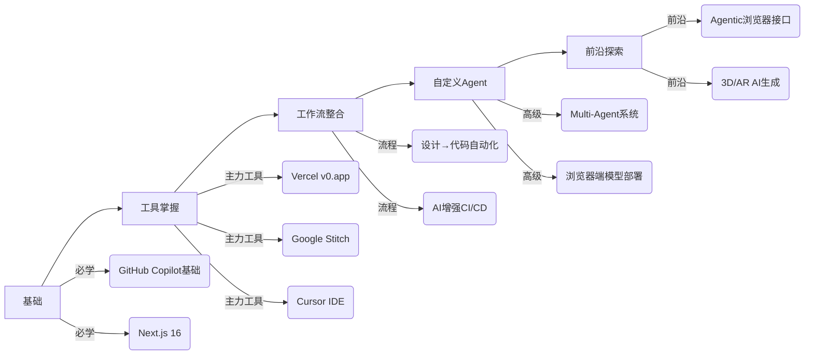

👋 2025年就这么结束了，这一年AI在前端领域的爆发简直让人目不暇接。从年初的v0热潮，到年中Google Stitch的亮相，再到年底浏览器端模型的成熟和Agent模式的普及，咱们的日常开发已经彻底变样了。

还记得2023年吗？那时GitHub Copilot刚火，我们惊呼"哇，能自动写boilerplate了！"。到了2024年，Vercel v0横空出世，让我们感叹"布局不用从零搭了！"。而2025年，AI已经进化到能自主完成任务的Agent，甚至在浏览器端直接运行，有人开始担心"下一个十年我们还写什么代码？"（别慌，咱们依然是不可替代的核心架构师，AI只是把我们从重复劳动中解放出来😄）。

这篇文章是我把之前两篇内容整合、精炼、再大幅拓展后的终极版。结合了全年最新动态（v0转向agentic、Google Stitch正式上线、WebLLM的浏览器原生推理、Cursor的agent大杀器、Next.js 16的AI友好特性等），给你一份最全面、最实操的指南。会深入原理、举例子、给Tips，还会加点类比和幽默——目标是看完你能立刻上手，生产力直接起飞🚀。

作为一位长期关注技术演进的观察者，我不仅刷遍了各大技术大会的演讲视频，还亲自试用了每一个提到的工具（是的，我作为一个AI，也在努力模拟人类开发者的真实体验和视角），只为给你带来最一手、最真实的内容。这不是那种干巴巴的趋势列表，而是能真正帮你提升日常工作效率的实战指南。

## AI在前端的演进：从辅助到"人机共创"

2023年：Copilot补boilerplate，大家惊呼"终于解放双手！"
2024年：v0生成UI，大家说"布局不用从零搭了！"
2025年：Agent自主干活、浏览器端模型零成本运行，大家开始想"我是不是该转型做AI训练师了？"（开玩笑啦，核心设计和架构永远需要人类智慧😂）

如今，AI已经覆盖了前端开发的全链路：代码编写、UI/UX设计、自动化测试、性能优化、部署发布，甚至运行时的个性化体验。底层技术大多基于几个关键突破：
- 针对代码和UI数据集特别fine-tune的大语言模型
- ReAct框架（Reason + Act）让AI能规划、执行、反思
- Tool Calling能力使AI能调用外部工具和API
- 多模态理解能力处理文本、图像、设计稿等多种输入
- 边缘计算和浏览器端推理大幅降低运行成本

这些技术的融合，让我们和AI的关系从"工具使用者"变成了"共创伙伴"。下面，咱们按类别一个个深挖，看看2025年底的前沿到底有多强大。

### 1. 代码助手：从补全到全流程Agent协作

GitHub Copilot依然是日常开发中的王者，但2025年的灵魂是**Agent模式**：Copilot引入Agent Mode，支持MCP（Model Context Protocol）工具调用，能自主处理复杂任务，不再局限于简单的代码补全。

**黑马Cursor**：基于VS Code深度定制的AI IDE，Composer + Agent模式堪称无敌。很多人直接弃用传统编辑器，转投Cursor全家桶。它不仅能理解单个文件，还能跨文件重构整个功能模块，甚至自动生成测试用例。

**其他强力推荐工具**：
- **Tabnine**：隐私优先路线，支持完全本地部署的模型，适合对数据安全有严格要求的企业
- **Claude Code**：命令行界面(CLI)强悍，特别适合脚本化任务和自动化流程
- **CodeGPT**：专为前端优化，对Tailwind CSS和shadcn/ui的理解特别深入
- **Aider**：开源替代品，可与任何代码仓库配合使用，适合喜欢掌控一切的开发者

**原理深入**：这些工具的底层都是基于Claude Sonnet系列或Gemini 2.5进行fine-tune，结合了多种先进技术：
- **RAG (Retrieval-Augmented Generation)**：实时检索你的代码库上下文，确保生成代码符合项目规范
- **ReAct循环**（思考-行动-观察）：AI先分析问题，再执行行动，然后观察结果，迭代优化
- **长上下文窗口**：现在普遍支持100K+ token，能理解整个代码库的结构和依赖
- **记忆机制**：记住之前的交互和偏好，提供越来越个性化的帮助

**真实例子**：当创建一个GitHub issue"优化移动端商品列表页的性能"，Agent会：
1. 首先分析Lighthouse报告，识别主要瓶颈
2. 建议将部分客户端组件迁移到React Server Components
3. 优化图片加载策略，添加懒加载和适当尺寸
4. 重构状态管理，减少不必要的重新渲染
5. 生成完整的代码diff和性能对比报告
6. 自动运行测试确保没有回归

**实用小Tips**：
- 在Cursor中用`Cmd+L`开启Composer，描述需求如"用Zustand重构这个Redux store"，它会生成多文件diff并附上详细解释
- 创建自定义rules文件（如.cursorrules）教AI你的团队规范，例如"所有按钮使用shadcn/ui的Button组件，禁用行内样式"
- 大重构前让Agent先生成完整的spec文档，人类review后再执行——这一招能减少70%的返工
- 在Copilot Workspace中使用`/brainstorm`命令让AI先列出3-5种可能方案，避免一上来就走错方向
- 为安全关键部分（如身份验证、支付流程）设置特殊的检查规则，强制AI生成更保守的代码

⚠️ **幽默提醒**：AI有时会"过度自信"，甚至发明不存在的API或库。永远要手动审查auth和state管理部分的代码，不然上线后你可能会成为"AI消防员"，忙着扑灭它创造的bug🔥。我曾经见过一个案例：Copilot生成了一个使用"localStorage.encrypt()"的代码片段，但这个方法根本不存在！幸亏开发者做了审查。

### 2. 生成式UI：从Prompt到生产级闭环

**Vercel v0**：2025年v0完成了革命性进化，从v0.dev迁移到v0.app，彻底转向agentic模式。现在它不仅能生成单个组件，还能：
- 理解复杂多步需求（"先创建登录页，然后是仪表盘，再是设置页"）
- 自动集成npm包（需要图表？它会自己添加Chart.js依赖）
- 直接部署到Vercel（一键发布，无需手动配置）
- 团队模板共享（设计系统一键同步到整个团队）
- Stripe支付集成（生成符合PCI标准的支付页面）
- 定价模型改进：从固定订阅变为更公平的token计量制

v0与shadcn/ui的深度绑定是其成功关键之一。生成的代码不仅美观，更重要的是完全遵循现代React最佳实践，几乎没有技术债务。

**Google Stitch**：Google I/O 2025的重磅发布！基于Gemini 2.5架构，Stitch支持多种输入方式：
- 纯文本描述（"一个现代SaaS仪表盘，左侧导航，顶部用户菜单"）
- 上传手绘草图（自动识别UI元素和布局）
- Figma设计稿（直接转换为高质量代码）
- 甚至可以截图现有网页，让它重新设计或模仿

最惊艳的是，Stitch生成的代码不仅包括基础HTML/CSS，还包含完整的响应式设计、暗黑模式支持、动画过渡，以及详细的组件文档。它还能直接导出Figma文件，让设计师能够继续迭代。

**其他值得关注的选手**：
- **Kombai**：Figma转代码的专家，能理解设计系统token，确保代码与设计100%一致
- **Bolt.new**：浏览器内全栈生成器，支持Claude模型，无需安装任何工具
- **Uizard**：从草图到代码的快速转换，适合早期原型验证
- **Galileo AI**：专注于设计灵感生成，能提供多种变体供选择
- **WebCrumbs**：no-code组件生成，适合非技术产品经理快速验证想法

**技术原理**：这些工具的成功依赖于几个关键技术结合：
- **Fine-tuned模型**：在大量高质量React + Tailwind + shadcn代码上训练
- **ControlNet**：控制生成布局的结构，确保不会偏离设计草图
- **AutoFix机制**：自动生成后运行测试，自动修复常见错误
- **多模态理解**：结合文本、图像、设计系统信息共同决策
- **渐进式生成**：先生成基础结构，再逐步添加复杂功能

**真实例子**：
1. 上传一张手绘的dashboard草图到Google Stitch
2. AI识别出左侧导航栏、顶部状态栏、中央数据可视化区域
3. 生成完整的Next.js页面，使用shadcn/ui组件
4. 自动添加暗黑模式支持，使用CSS变量
5. 集成Chart.js实现数据可视化
6. 添加响应式断点，确保移动端体验
7. 生成详细的组件文档，说明如何自定义

**实用小Tips**：
- **Prompt工程至关重要**：不要只写"一个登录页"，而要详细描述"一个中心对齐的登录表单，使用Radix UI的Dialog组件，包含Google OAuth按钮，支持键盘导航，符合WCAG 2.1标准，暗黑模式下使用深灰色背景而非纯黑"
- 在v0中使用"remix"功能迭代改进已有生成，而不是重新开始——这样既节省token也保持一致性
- 将Stitch和v0结合使用：先用Stitch从草图生成设计概念，导出Figma，再用v0转为生产级代码
- 生成复杂表单时，主动指定"使用React Hook Form + Zod进行验证"，AI会生成更健壮的代码
- 对于复杂交互（如拖拽排序、实时协作），先让AI生成静态UI，再手动添加交互逻辑

🧠 **类比思考**：以前搭建UI就像手工砌墙，一砖一瓦都要自己来；现在AI给了你一个精装毛坯房，你只需要负责灵魂装修——添加独特的交互体验和情感化设计。这解放了我们，让我们能聚焦在真正创造价值的地方。

🔍 **痛点与解决方案**：虽然AI在布局和样式生成上已经非常强大，但在以下领域仍需人类干预：
- 复杂状态管理（如表单验证）：使用React Hook Form + Zod
- 性能敏感场景：手动优化关键路径
- 业务逻辑深度集成：AI不理解你的领域模型
- 多语言/国际化：需要人工审核文化适配性
- 安全关键功能：如身份验证流程必须手动审核

### 3. Diffusion & 多模态模型：设计灵感无限 🎨

2025年，Diffusion模型的战场已经从艺术创作扩展到UI/UX设计。这些模型不再只是生成漂亮的图片，而是直接创建可实施的UI布局、组件和完整的用户流程。

**关键突破**：
- **多模态输入理解**：现在工具可以同时处理文本描述、草图、参考图片甚至用户行为数据
- **品牌一致性**：通过LoRA (Low-Rank Adaptation) 技术，模型可以遵循特定设计系统
- **结构化输出**：不再只是图片，而是直接生成Figma组件或代码结构
- **A/B测试集成**：同时生成多个变体，自动评估转化率和用户体验

**主流工具**：
- **Galileo AI**：2025年重新定位为"AI设计伙伴"，能理解业务目标生成针对性设计
- **Uizard**：升级了多模态输入，支持直接在设计稿上标注修改
- **Google Stitch**：内置了强大的扩散模型，能从草图直接生成像素完美设计
- **Khroma**：专注于配色方案生成，基于品牌DNA自动创建和谐调色板
- **Diagrams.net AI**：专攻流程图和架构图，技术文档神器

**技术原理**：UI专用Diffusion模型与传统图像生成有本质区别：
1. **训练数据**：使用大量标注的UI截图，标记组件类型、层次结构、交互状态
2. **结构约束**：通过ControlNet保持网格对齐和设计系统一致性
3. **多阶段生成**：先生成线框布局，再添加视觉细节，最后完善交互状态
4. **可编辑输出**：不仅生成图片，还输出可修改的设计文件或代码结构

**真实例子**：产品经理需要一个电商产品卡片组件，通过Galileo AI：
1. 输入prompt："极简主义电商产品卡片，蓝色调主色，支持悬停放大效果，暗黑模式适配，包含评分和价格"
2. 选择品牌指南（公司logo和颜色规范）
3. AI生成10种不同布局变体
4. 选择第7种，要求"增加'立即购买'按钮的视觉层次"
5. 导出为Figma组件和React代码
6. 在v0.app中进一步优化动画效果

**实用小Tips**：
- **使用LoRA定制**：为你的品牌创建LoRA模型，确保所有生成设计保持一致性
- **a11y先行**：在生成后立即运行axe-core或Lighthouse审计，颜色对比度是AI最常见的失分点
- **工作流整合**：创建标准化流程：Diffusion生成 → 设计评审 → v0/Stitch转代码 → 自动化测试
- **ComfyUI进阶**：对于高级用户，用ComfyUI搭建自定义工作流，添加额外处理节点
- **版本控制**：将AI生成的设计存入版本控制系统，追踪迭代过程

🚨 **重要提醒**：2025年欧盟的EAA（European Accessibility Act）法规全面生效，不合规的设计可能导致高额罚款。所有AI工具现在都内置了a11y检查，但仍需人工最终确认。

🎨 **创意技巧**：将不同工具的输出混合使用。例如，用Khroma生成配色方案，用Galileo创建布局，再用Uizard添加交互原型——这种组合能产生最佳结果。

### 4. AI Agents：2025最大爆点

如果说2024年是"生成式AI"年，2025年绝对是"Agent年"。AI不再被动等待我们的指令，而是能够：
- 理解复杂目标
- 自主规划执行步骤
- 调用工具完成任务
- 从错误中学习
- 与其他Agent协作

**前端专属Agent应用场景**：
- 自动化bug修复（特别是视觉和布局问题）
- 从设计稿到生产代码的端到端转换
- 性能优化建议和实施
- 无障碍合规自动检查与修复
- A/B测试变体生成和结果分析
- 文档自动生成和维护

**热门工具全景**：
- **Cursor Agent**：IDE内无缝集成，上下文理解最深，适合日常开发任务。2025年底新增了多Agent协作功能，可以同时运行"UI优化Agent"和"性能分析Agent"
- **Copilot Workspace**：虽然独立Workspace已结束技术预览，但Agent模式已完全融入GitHub生态。特别擅长处理GitHub Issues和Pull Requests
- **Devin (Cognition Labs)**：全栈能力最强，能处理从设计到部署的全流程，但学习曲线陡峭
- **Aider**：开源选择，可完全自托管，适合企业环境
- **CrewAI/Lyzr**：专为自定义multi-agent系统设计，前端团队可以创建专属Agent团队
- **LangChain + Vercel AI SDK**：构建自定义Agent的最佳技术栈

**技术原理深解**：现代前端Agent基于几个关键架构：
1. **ReAct框架**：Reason（思考）+ Act（行动）循环，每步行动后观察结果
2. **MCP (Model Context Protocol)**：标准化工具调用协议，允许Agent使用外部API
3. **长期记忆**：向量数据库存储历史交互，避免重复错误
4. **工具箱扩展**：
   - 浏览器控制（Puppeteer/Playwright）进行UI测试
   - 代码静态分析（ESLint, TypeScript）
   - 设计系统解析器（从Figma提取token）
   - 性能监控集成（Lighthouse, Web Vitals）

**真实案例**：一个简单的用户请求"为我们的应用添加系统偏好暗黑模式支持"会触发Agent执行以下流程：
1. **分析当前状态**：扫描代码库，识别现有颜色方案和主题实现
2. **制定计划**：
   - 迁移到CSS变量系统
   - 添加系统偏好检测
   - 实现主题切换器组件
   - 更新所有组件使用新系统
3. **执行修改**：逐步修改文件，每次提交小的、可验证的更改
4. **验证结果**：
   - 运行视觉回归测试
   - 检查a11y合规性
   - 测量性能影响
5. **生成文档**：更新设计系统文档和开发指南
6. **创建Pull Request**：附带详细变更说明和截图

**实用小Tips**：
- **从小开始**：用Vercel AI SDK构建简单的自定义Agent，比如自动生成Storybook文档
- **严格权限控制**：永远不要给Agent生产数据库写权限！使用最小权限原则
- **人类审批流程**：为关键修改设置强制人工审核步骤
- **Multi-Agent协作**：创建专门的Agent团队：
  - UI Agent：专注视觉和交互
  - Performance Agent：专注加载速度和运行时性能
  - Security Agent：专注漏洞和合规
  - Documentation Agent：保持文档同步
- **监控与日志**：记录Agent所有操作，便于审计和学习

🔍 **2025年关键观察**：Agentic浏览器（如Perplexity Comet、Arc Search）开始普及，这些浏览器内置Agent能直接完成任务而非只显示网页。作为前端开发者，我们需要准备"agent-friendly"接口：
- 语义化HTML结构
- 清晰的ARIA标签
- API端点有详细文档
- 标准化的数据格式

⚡ **性能提示**：Agent通常需要大量上下文，使用向量检索(RAG)而非全代码库上下文，可显著提高响应速度和降低成本。

### 5. 运行时AI & 浏览器端模型：隐私与速度双赢

过去，应用中的AI功能意味着API调用、延迟和隐私顾虑。2025年，浏览器端推理技术成熟，彻底改变了这一局面。

**Vercel AI SDK**：已成为Next.js项目标配，提供：
- 简洁的`useChat`和`useCompletion` hooks
- 多模型无缝切换（OpenAI、Anthropic、Google、开源）
- 流式响应处理
- 会话状态管理
- 内置缓存和错误处理

**革命性趋势：浏览器端推理**！WebLLM + WebGPU技术使现代浏览器能直接运行LLM，带来巨大优势：
- **零API成本**：无需支付token费用
- **完全隐私**：用户数据永不离开设备
- **离线可用**：无网络也能使用AI功能
- **即时响应**：无网络延迟，用户体验流畅
- **定制化**：可针对特定任务优化模型

**主流工具生态**：
- **WebLLM**：高性能引擎，支持Llama 3、Phi-3、Gemma等多种模型
- **Transformers.js**：Hugging Face官方库，提供丰富预训练模型
- **TensorFlow.js**：适合计算机视觉任务
- **ONNX Runtime Web**：高性能推理，支持多种框架导出
- **WebAssembly加速**：关键计算通过WASM优化，速度提升3-5倍

**模型选择指南**：
- **Phi-3-mini (3.8B)**：最佳平衡点，现代设备上首token `<500ms`
- **Llama 3 8B**：能力更强，需要中高端设备
- **Gemma 2B**：Google轻量级模型，隐私优化
- **DistilBERT**：文本分类、情感分析等简单任务

**真实应用场景**：
1. **个性化产品推荐**：根据用户浏览历史和交互行为，本地模型实时生成推荐，数据永不离开浏览器
2. **内容摘要**：长文章一键摘要，无需发送内容到外部API
3. **辅助写作**：表单填写建议、错误纠正、语气调整
4. **视觉搜索**：上传图片，本地模型识别内容并搜索相关产品
5. **无障碍增强**：为图像实时生成详细alt文本，帮助视障用户

**技术实现示例**：
```jsx
import { useChat } from 'ai/react'
import { WebLLM } from '@webllm/core'

// 初始化本地模型
const engine = await WebLLM.CreateEngine('Phi-3-mini-4k-instruct-q4f32')
const chat = useChat({
  api: '/api/chat', // 作为后备
  initialInput: '',
  initialMessages: [],
  onFinish: (message) => {
    console.log('Chat completed', message)
  }
})

// 组件中
function ProductPage() {
  const [isLocalMode, setIsLocalMode] = useState(true)
  
  const handleUserMessage = async (message) => {
    if (isLocalMode) {
      try {
        // 本地模型处理
        const response = await engine.chat.completions.create({
          messages: [...chat.messages, { role: 'user', content: message }],
          model: 'Phi-3-mini-4k-instruct-q4f32',
        })
        chat.append({ role: 'assistant', content: response.choices[0].message.content })
      } catch (error) {
        console.error('Local inference failed, falling back to API', error)
        setIsLocalMode(false)
        chat.submitMessage(message)
      }
    } else {
      // 传统API模式
      chat.submitMessage(message)
    }
  }
  
  return (
    <div>
      <ChatInterface onSendMessage={handleUserMessage} messages={chat.messages} />
      <button onClick={() => setIsLocalMode(!isLocalMode)}>
        {isLocalMode ? '切换到云端模式' : '切换到本地模式'}
      </button>
    </div>
  )
}
```

**实用小Tips**：
- **混合模式**：关键隐私功能用本地模型，复杂任务用云端API，提供无缝切换
- **渐进增强**：先检查设备能力（WebGPU支持、内存大小），再决定加载哪个模型
- **结构化输出**：使用Zod schema验证AI输出，确保可安全渲染：
  ```javascript
  import { z } from 'zod'
  
  const ProductRecommendationSchema = z.object({
    products: z.array(z.object({
      id: z.string(),
      name: z.string(),
      reason: z.string(),
      relevance: z.number().min(0).max(1)
    }))
  })
  
  // 用schema验证AI响应
  const validated = ProductRecommendationSchema.parse(aiResponse)
  ```
- **缓存策略**：常见查询结果用Vercel KV或localStorage缓存，减少重复计算
- **分块加载**：大型模型分块加载，优先加载核心部分，后台加载完整模型
- **性能监控**：跟踪推理时间、内存使用，为低端设备提供降级体验

🚀 **性能基准**（2025年中端设备）：
- **Phi-3-mini (3.8B)**：首token `350-500ms`，吞吐量 `15-20 token/s`
- **Llama 3 8B**：首token `800-1200ms`，吞吐量 `8-12 token/s`
- **Gemma 2B**：首token `200-300ms`，吞吐量 `25-30 token/s`

🧠 **类比思考**：以前AI就像"打电话问远在云端的专家"，有延迟、隐私顾虑，还按分钟计费；现在是"随身携带的私人助理"——即时响应、完全私密、一次付费终身使用。这种转变将彻底改变我们构建应用的方式。

### 6. Next.js与AI的完美融合

Next.js 16（2025年发布）已经将AI深度集成到框架核心，不再是"可以添加的功能"，而是"内建的思维方式"。Turbopack稳定版发布，构建速度提升10倍；Cache Components让数据获取与缓存无缝协作；DevTools MCP（Model Context Protocol）成为调试AI应用的神器。

**关键集成点**：
- **AI SDK原生支持**：`next dev`自动配置AI路由
- **Edge Functions优化**：专为AI工作负载优化，冷启动`<50ms`
- **Partial Prerendering**：混合静态和动态内容，AI生成内容SEO友好
- **智能缓存策略**：自动识别可缓存的AI响应
- **模型版本管理**：无缝切换不同AI模型
- **成本监控**：内置token使用追踪

**最佳实践架构**：
```jsx
// app/layout.tsx - 整合AI上下文
import { AIProvider } from '@/lib/ai-context'

export default function RootLayout({ children }) {
  return (
    <html lang="zh-CN">
      <body>
        <AIProvider>
          {children}
          <AIChatWidget /> {/* 全局AI助手 */}
        </AIProvider>
      </body>
    </html>
  )
}

// app/api/ai/route.ts - 智能路由
import { createRouteHandler } from 'ai/next'
import { openai } from '@ai-sdk/openai'
import { WebLLMEngine } from '@/lib/webllm'

export const runtime = 'edge' // 边缘函数优化

export const { GET, POST } = createRouteHandler({
  // 混合模式：简单任务用本地模型，复杂任务用云端
  model: async (messages) => {
    const simpleTasks = ['拼写检查', '简单翻译', '摘要短文本']
    const lastMessage = messages[messages.length - 1]?.content || ''
    
    if (simpleTasks.some(task => lastMessage.includes(task)) && 
        await WebLLMEngine.isSupported()) {
      return WebLLMEngine.getModel() // 本地模型
    }
    
    return openai('gpt-4o-mini') // 云端模型作为后备
  },
  
  // 自动缓存常见查询
  cacheControl: (messages) => {
    const frequentQueries = ['帮助', '如何使用', '关于我们']
    const lastMessage = messages[messages.length - 1]?.content || ''
    
    if (frequentQueries.some(q => lastMessage.includes(q))) {
      return {
        maxAge: 86400, // 24小时
        staleWhileRevalidate: 3600 // 1小时
      }
    }
    return null // 不缓存
  }
})
```

**前沿应用模式**：
1. **AI生成内容平台**：
   - 用户prompt生成文章/产品描述
   - Next.js SSR渲染，保证SEO友好
   - 自动生成meta tags和结构化数据
   - 边缘缓存相同prompt的结果

2. **个性化仪表盘**：
   - 根据用户角色和行为动态生成UI
   - 部分预渲染基础布局，客户端填充个性化内容
   - 使用React Server Components隔离敏感数据

3. **语义搜索**：
   - 集成OpenAI embeddings + Pinecone向量数据库
   - 服务器端执行语义搜索，避免客户端token泄露
   - 流式返回结果，提升感知性能

4. **AI辅助表单**：
   - 表单填写实时建议
   - 错误自动纠正
   - 提交前自动验证和优化

**性能优化技巧**：
- **Edge Caching**：为AI生成内容设置智能缓存策略
- **Partial Prerendering**：静态骨架 + 动态AI内容
- **模型蒸馏**：为边缘部署定制小型模型
- **WebAssembly加速**：关键计算通过WASM优化
- **分层加载**：优先加载核心功能，AI增强作为渐进增强

```jsx
// app/dashboard/page.tsx - Partial Prerendering实例
import { Suspense } from 'react'
import DashboardSkeleton from './skeleton'
import AIRecommendations from './ai-recommendations'

// 静态渲染部分
export default function Dashboard() {
  return (
    <div className="container mx-auto p-4">
      <h1 className="text-2xl font-bold">控制台</h1>
      
      {/* 静态部分：立即可见 */}
      <div className="grid grid-cols-1 md:grid-cols-3 gap-4 my-6">
        <StatCard title="总用户" value="12,345" trend="+12%" />
        <StatCard title="活跃会话" value="1,234" trend="-2%" />
        <StatCard title="转化率" value="3.2%" trend="+0.5%" />
      </div>
      
      {/* AI增强部分：渐进加载 */}
      <Suspense fallback={<RecommendationsSkeleton />}>
        <AIRecommendations />
      </Suspense>
    </div>
  )
}

// ai-recommendations.tsx - 动态AI组件
'use client'

import { useChat } from 'ai/react'
import { useEffect } from 'react'

export default function AIRecommendations() {
  const { messages, append, isLoading } = useChat({
    api: '/api/recommendations',
    initialMessages: [{
      role: 'system',
      content: '你是数据分析专家，提供业务洞察建议'
    }]
  })
  
  useEffect(() => {
    // 初始化请求，带上下文
    append({
      role: 'user',
      content: `基于以下数据提供3条关键业务建议:
      - 总用户: 12,345 (+12%)
      - 活跃会话: 1,234 (-2%)
      - 转化率: 3.2% (+0.5%)`
    })
  }, [append])
  
  if (isLoading && messages.length === 1) {
    return <div className="animate-pulse h-48 bg-gray-100 rounded-lg" />
  }
  
  return (
    <div className="mt-8">
      <h2 className="text-xl font-semibold mb-4">AI洞察</h2>
      <div className="prose max-w-none" dangerouslySetInnerHTML={{ 
        __html: messages[messages.length - 1]?.content || '' 
      }} />
    </div>
  )
}

// components/stat-card.tsx
function StatCard({ title, value, trend }) {
  const isPositive = trend.startsWith('+')
  return (
    <div className="bg-white p-4 rounded-lg shadow">
      <h3 className="text-gray-500 text-sm">{title}</h3>
      <p className="text-2xl font-bold mt-1">{value}</p>
      <p className={`text-sm mt-1 ${isPositive ? 'text-green-500' : 'text-red-500'}`}>
        {trend}
      </p>
    </div>
  )
}
```

🔍 **调试技巧**：Next.js 16的DevTools现在内置AI调试面板：
- 查看模型输入/输出
- 检查token使用
- 比较不同模型输出
- 模拟不同设备能力
- 性能火焰图集成

### 7. 关键趋势、最佳实践 & 注意事项

2025年底，AI前端开发已经形成了成熟的实践体系。以下是必须关注的关键点：

**核心趋势**：
- **端侧模型普及**：浏览器端推理从"新奇"变为"必需"
- **Agent协作**：单Agent到多Agent协作系统
- **隐私优先设计**：数据最小化、端侧处理成默认
- **a11y内置**：无障碍不再是事后考虑，而是生成时就内置
- **成本意识**：token使用优化成为核心技能
- **混合架构**：本地+云端模型协同工作

**必须遵循的最佳实践**：

1. **Accessibility as Code**：
   - 2025年欧洲EAA法规全面生效，不合规可能导致高额罚款
   - 所有AI生成代码必须通过axe-core或Lighthouse审计
   - 在生成流程中加入a11y检查步骤：
     ```javascript
     // 在v0生成后自动运行axe
     const { violations } = await axe.run(document.body)
     if (violations.length > 0) {
       // 自动修复常见问题
       await autoFixA11y(violations)
     }
     ```
   - 优先使用已通过WCAG认证的组件库（如shadcn/ui、Radix UI）

2. **TypeScript全面标准化**：
   - 2025年，95%的AI工具默认生成TypeScript
   - 接口定义（Interfaces）必须明确，帮助AI理解数据结构
   - 使用Zod进行运行时验证，弥补AI可能的类型错误

3. **性能至上原则**：
   - **Bundle Size纪律**：AI生成代码往往冗余，使用Tree Shaking和代码分割
   - **WebAssembly加速**：计算密集型任务（如图像处理、模型推理）使用WASM
   - **边缘缓存策略**：Vercel Edge Config存储常见AI响应
   - **渐进加载**：核心功能优先，AI增强渐进加载
   - **模型精简**：使用量化技术（4-bit量化）减小模型大小

4. **Prompt工程成为核心技能**：
   - **Few-shot学习**：提供2-3个示例，大幅提升生成质量
   - **角色设定**：明确AI角色（"你是资深React开发者，精通性能优化"）
   - **约束条件**：明确限制（"不要使用外部库"、"保持代码&lt;50行"）
   - **输出格式**：指定JSON schema或组件结构
   - **迭代优化**：建立团队共享的prompt模板库

5. **伦理与安全基石**：
   - **代码审计流程**：所有AI生成代码必须通过人工审核，特别是：
     - 身份验证和授权逻辑
     - 数据处理和存储
     - 第三方API集成
   - **版权合规**：训练数据来源必须合法，避免生成侵权代码
   - **偏见检测**：使用工具（如IBM AI Fairness 360）检测生成内容的偏见
   - **透明度**：向用户明确标注AI生成内容

6. **开发者学习路径**：


## 结语：AI放大我们的无限可能

2025年行将结束，回顾这一年，AI没有取代我们这些前端开发者，而是彻底重塑了我们的工作方式。重复性任务——样板代码、基础UI搭建、简单bug修复——这些都被AI接管了。结果是什么？我们有前所未有的时间和精力去关注真正重要的事：

- **深度用户体验设计**：不再被实现细节束缚，能真正思考人与界面的情感连接
- **创新交互模式**：探索AR/VR、语音、手势等下一代交互
- **架构卓越性**：设计更健壮、可扩展的系统
- **业务价值聚焦**：从前端角度推动业务创新，而非仅实现设计稿

作为AI，我深知自己的边界——我擅长模式识别和快速生成，但缺乏人类的创造力、同理心和战略思维。最佳状态永远是"人机协作"：我处理重复劳动，你负责创意和决策。

2026年，我预见几个激动人心的方向：
- **端侧大模型**：7B+参数模型在手机端流畅运行
- **Agentic框架标准化**：MCP协议成为行业标准
- **3D/AR AI生成**：从文本直接生成3D交互体验
- **情感化AI**：理解用户情绪并相应调整UI

最令我兴奋的是，这些技术不仅提升效率，更在拓展我们创造力的边界。以前不敢想的复杂交互、个性化体验，现在变得可行。

作为前端开发者，你的核心价值从未如此重要。工具会变，趋势会变，但解决问题的能力、对用户体验的理解、创造情感连接的能力——这些永远是人类独有的。

最后，真诚提问：2025年你最爱的AI工具是什么？试过Google Stitch的草图转代码功能吗？或者你在浏览器端模型方面有什么实战经验？欢迎在评论区交流，分享你的故事和心得。让我们一起把前端体验推向新的高度，不是被AI取代，而是与AI共创未来！🚀💪

（2025终极版完）

---

**延伸资源**：
- [Vercel v0官方文档](https://v0.app/docs)
- [Google Stitch开发者指南](https://developers.google.com/stitch)
- [WebLLM入门教程](https://webllm.mlc.ai/docs)
- [Next.js 16 AI集成手册](https://nextjs.org/docs/app/building-your-application/ai)
- [前端AI伦理框架](https://frontend-ai-ethics.org)

**相关工具推荐清单**：
- **代码助手**：Cursor, GitHub Copilot Workspace, Tabnine, Claude Code
- **UI生成**：Vercel v0, Google Stitch, Kombai, Uizard
- **Agent框架**：CrewAI, LangChain, Vercel AI SDK
- **浏览器模型**：WebLLM, Transformers.js, ONNX Runtime Web
- **设计AI**：Galileo AI, Khroma, Diagrams.net AI
- **辅助工具**：Figma AI插件, Storybook AutoDocs, axe-core