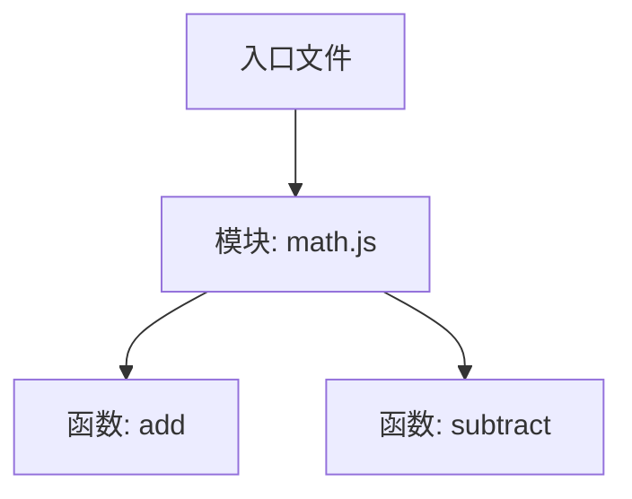

在前端项目中，打包体积的大小直接影响页面加载速度与用户体验。近年来，**TreeShaking** 作为一种代码优化技术，帮助开发者剔除无用代码，从而大幅度减小打包产物的体积。本文将深入解析 TreeShaking 的原理、最佳实践，并通过对比 **Webpack** 与 **Vite** 在 TreeShaking 方面的实现，带你全面了解如何利用这一技术让打包体积瘦身 40%。

---

## 目录

1. [TreeShaking 简介](#treeshaking简介)
2. [TreeShaking 的工作原理](#treeshaking的工作原理)
3. [实践中的配置与注意事项](#实践中的配置与注意事项)
4. [Webpack vs Vite 对比](#webpack-vs-vite-对比)
5. [实际案例：打包体积瘦身 40%](#实际案例打包体积瘦身40)
6. [总结与展望](#总结与展望)

---

## TreeShaking 简介

TreeShaking 是一种静态代码分析技术，它利用 ES6 模块化的静态结构特性，在打包过程中识别出未被引用的代码并将其剔除。通过这种方式，可以极大地减少最终产出的代码量，从而提升页面加载速度和整体性能。

### TreeShaking 的优势

- **减少打包体积**：剔除未使用的代码，减小最终文件的大小。
- **提高运行效率**：加载的代码更精简，浏览器解析和执行速度更快。
- **改善代码质量**：在开发过程中，更容易发现和清理冗余代码。

---

## TreeShaking 的工作原理

TreeShaking 主要依赖 ES6 模块（ES Modules）的静态结构特性，因为这种模块系统在编译阶段就能确定依赖关系。其基本原理包括以下几点：

1. **静态分析**  
   利用 ES Modules 的静态导入（`import`/`export`）特性，打包工具可以在编译阶段构建出完整的依赖图，精确标记哪些模块和代码块被实际使用。

2. **标记未使用的代码**  
   通过分析整个依赖图，打包工具可以判断哪些导出没有被引用，并将这些代码标记为“死代码”。

3. **剔除无用代码**  
   在最终打包过程中，经过压缩工具（如 Terser、esbuild 等）的处理，将这些未被使用的代码剔除。

> **注意：** TreeShaking 依赖于 ES6 模块化，若项目中使用 CommonJS 模块（例如 `require` 和 `module.exports`），则无法进行有效的静态分析。

### 示例代码

假设我们有一个模块 `math.js`：

```js
// math.js
export function add(a, b) {
  return a + b;
}

export function subtract(a, b) {
  return a - b;
}
```

在另一个文件中仅使用 `add` 方法：

```js
// index.js
import { add } from "./math";

console.log(add(2, 3));
```

经过 TreeShaking 处理后，`subtract` 方法会被剔除，从而减小打包体积。

### TreeShaking 原理图

下面是一个简化的依赖图示意，展示了入口文件与模块之间的关系：



---

## 实践中的配置与注意事项

### 1. 使用 ES Modules

确保你的代码使用 ES Modules 语法，避免混用 CommonJS。对于第三方库，可以查阅其文档，选择支持 ES Modules 的版本。

### 2. 配置 package.json 中的 sideEffects

在项目的 `package.json` 文件中，添加或设置 `sideEffects` 字段，告知打包工具哪些文件或模块没有副作用，可以安全地进行 TreeShaking。

```json
{
  "name": "my-project",
  "version": "1.0.0",
  "sideEffects": false
}
```

> **提示：** 如果某些文件存在副作用，请在 `sideEffects` 字段中显式声明，例如：
>
> ```json
> "sideEffects": ["./src/some-side-effect-file.js"]
> ```

### 3. 使用合适的打包工具

不同打包工具对 TreeShaking 的支持程度各不相同，合理选择和配置工具是关键。下面我们将详细对比 Webpack 与 Vite 的实现与表现。

### 4. Babel 配置注意

如果你使用 Babel 进行转译，建议配置 `modules: false`，以保持 ES Modules 的语法不被转换为 CommonJS，这样打包工具才能正确识别模块依赖关系。

```js
// babel.config.js
module.exports = {
  presets: [
    ["@babel/preset-env", { modules: false }],
    "@babel/preset-typescript",
    "@babel/preset-react",
  ],
  plugins: [["@babel/plugin-transform-runtime", { corejs: 3 }]],
};
```

4. **迁移到 Vite**
   - 从 Webpack 迁移到 Vite，充分利用其原生 ESM 支持
   - 开发环境启动时间从 40s 降至 2s
   - 配置 vite.config.ts 启用构建优化：
   ```ts
   export default defineConfig({
     build: {
       target: "es2015",
       minify: "terser",
       terserOptions: {
         compress: {
           drop_console: true,
           drop_debugger: true,
         },
       },
       rollupOptions: {
         output: {
           manualChunks: {
             "react-vendor": ["react", "react-dom"],
             utils: ["lodash-es", "axios"],
           },
         },
       },
     },
   });
   ```
5. **依赖优化**
   - 使用 `npm-check` 定期扫描并清理未使用的依赖
   - 将 moment.js (330KB) 替换为 dayjs (2.8KB)
   - 按需引入 lodash-es，避免完整引入
   - 将 antd 组件改为按需加载

通过上述优化，项目主包体积从原来的 2.1MB 降至 1.26MB，首屏加载时间从 3.2s 降至 1.8s。具体收益：

- JS Bundle 体积减少 40%
- 首屏加载速度提升 43.75%
- 开发环境启动速度提升 95%
- 生产环境构建时间减少 60%

这些优化不仅显著提升了用户体验，还大大改善了开发效率。

---

## 总结与展望

TreeShaking 作为前端代码优化的重要技术，通过静态分析和合理配置，可以有效剔除无用代码，实现显著的打包体积缩减。在实践中，我们需要注意以下几点：

1. **工具选择要因地制宜**

   - 新项目优先考虑 Vite
   - 老项目需要评估迁移成本
   - 特殊场景可能需要自定义配置

2. **持续优化很重要**

   - 定期检查并清理无用依赖
   - 关注新的优化技术和工具
   - 建立性能监控体系

3. **团队协作的关键**
   - 制定统一的代码规范
   - 建立依赖引入审核机制
   - 定期进行性能优化培训

未来，随着工具链的发展，TreeShaking 的应用会更加广泛和智能。我们期待：

- **更智能的静态分析：** 能够处理更复杂的代码依赖关系
- **更快的构建速度：** 借助 Rust 等高性能语言重写构建工具
- **更好的生态整合：** 与 TypeScript、ESBuild 等工具的深度整合

作为前端开发者，我们要持续关注这个领域的发展，在实践中不断探索和创新，为项目带来更好的性能优化效果。

---

> **相关阅读：**
>
> - [深入理解 ES Modules](https://developer.mozilla.org/zh-CN/docs/Web/JavaScript/Guide/Modules)
> - [Webpack 官方文档](https://webpack.js.org/)
> - [Vite 官方文档](https://vitejs.dev/)

Happy Coding!
