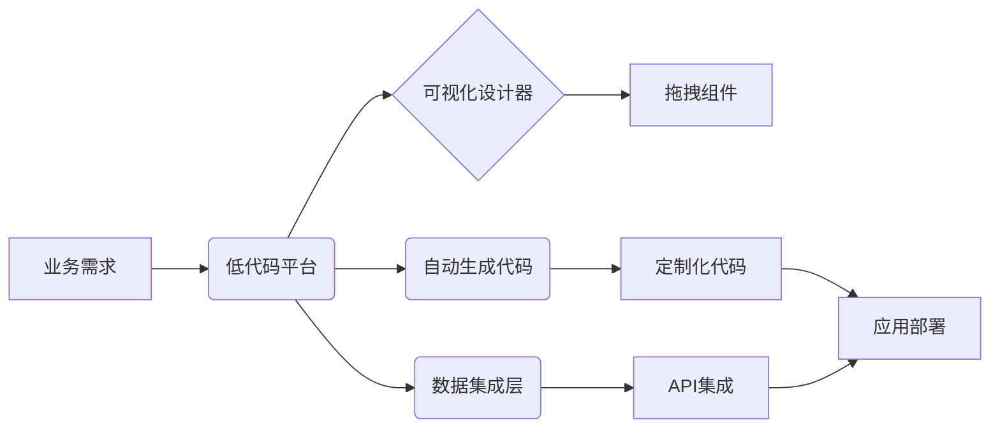

随着企业对数字化转型的需求日益增长，如何在短时间内开发出高质量的业务应用成为了关键问题。低代码平台（Low-Code Platform）正是在这样的背景下应运而生，通过可视化界面、拖拽式组件和自动化工具，极大地简化了软件开发过程，使得非专业开发者也能参与到应用构建中。

## 什么是低代码平台？

低代码平台是一种软件开发平台，它通过可视化建模、拖拽式界面设计和预设的组件库，使开发者能够用极少的手写代码快速构建应用程序。与传统的手写代码开发相比，低代码平台大幅提高了开发效率，同时也降低了对开发技术的要求。

### 低代码与无代码的区别

- **低代码平台**：允许开发者在可视化操作的基础上，根据需要编写少量代码以实现更复杂的业务逻辑和定制功能。适合有一定技术背景的业务人员和开发团队。
- **无代码平台**：完全依赖于可视化工具构建应用，通常适用于简单的应用场景和业务流程，非技术人员也能快速上手，但定制化能力较低。

## 低代码平台的核心特点

1. **可视化开发界面**  
   低代码平台通常提供画布式设计工具，开发者可以通过拖拽控件、组件和预设模块来构建页面和流程。  
   例如，在构建一个内部审批系统时，用户可以直接在画布上添加表单、按钮、流程节点，而无需从零开始编码。

2. **预置组件和模块化开发**  
   内置丰富的组件库，如数据表格、图表、用户认证、消息通知等，极大地缩短了开发时间。  
   例如，企业在构建客户管理系统时，可以直接调用已有的“客户列表”、“数据筛选”、“报表生成”等组件。

3. **自动化代码生成与集成**  
   低代码平台通常会根据可视化配置自动生成标准化代码，并且支持与现有系统或第三方 API 的无缝集成。  
   这样可以保证在需要时进行进一步的定制和扩展，同时保留系统的可维护性。

4. **跨平台与多终端适配**  
   许多低代码平台支持一套代码同时生成 PC、移动端及平板设备上的应用，减少了多端开发的成本和工作量。

## 低代码平台的优势

- **开发效率高**  
  通过可视化设计和自动化工具，开发周期大幅缩短。例如，一个传统开发周期需要几个月完成的项目，在低代码平台上可能只需要数周甚至数天即可上线。

- **降低人力成本**  
  低代码平台降低了对高级开发人才的依赖，企业可以通过培养业务人员和简单的开发技能人员来完成复杂系统的搭建。

- **业务快速响应**  
  当业务需求发生变化时，低代码平台允许快速调整和迭代，企业能够更敏捷地应对市场变化。

- **易于维护和扩展**  
  自动生成的代码通常遵循一定的标准和规范，便于后续的维护和二次开发。同时，平台化的组件体系使得系统的扩展和集成更加方便。

## 常见的低代码平台举例

- **OutSystems**  
  OutSystems 是全球领先的低代码平台之一，支持企业级应用开发，具有强大的集成能力和扩展性。它不仅支持前端的可视化设计，还能自动生成后端逻辑代码。

- **Mendix**  
  Mendix 专注于快速应用开发和数字化转型，适合构建复杂的业务流程和多端应用。其拖拽式的开发环境深受企业欢迎。

- **Microsoft PowerApps**  
  针对 Office 365 用户，PowerApps 提供了与 Microsoft 生态系统紧密结合的低代码解决方案，适用于构建企业内部的办公应用和流程自动化工具。

- **Appian**  
  Appian 以快速构建业务流程和工作流应用而著称，适用于金融、保险等行业需要高度定制化的解决方案。

## 实际应用场景与案例

### 案例 1：内部审批系统

某大型企业在内部推行数字化管理时，利用低代码平台开发了一套审批系统。通过可视化设计工具，业务人员在短时间内完成了从申请、审核到归档的完整流程，大大提高了审批效率。

### 案例 2：客户关系管理系统（CRM）

一家公司借助低代码平台构建了一套定制化的 CRM 系统，通过集成客户数据、销售流程和数据分析模块，实现了客户信息的全面管理，并与现有的 ERP 系统无缝对接。

### 案例 3：移动办公应用

为了适应远程办公需求，不少企业选择低代码平台开发移动应用。开发者只需在平台上设计界面和交互逻辑，即可生成适用于 iOS 和 Android 的应用程序，满足远程协作需求。

## 低代码平台的技术架构

低代码平台通常采用模块化、组件化设计，整体架构可以分为以下几个部分：

- **前端可视化设计器**  
  提供拖拽式界面和实时预览功能，支持用户通过画布方式构建页面和流程。

- **后端逻辑引擎**  
  根据前端配置自动生成业务逻辑代码，并支持通过脚本或插件进行二次开发。

- **数据管理与集成层**  
  内置数据模型设计工具，支持与数据库、RESTful API 及其他企业系统的集成。

- **自动化部署与监控**  
  支持自动化部署、持续集成/持续交付（CI/CD）以及应用性能监控，确保系统的稳定运行。

下面是一个简单的低代码平台架构示意图（使用 Mermaid 绘制）：

## 如何选择适合的低代码平台

在选择低代码平台时，企业应重点考虑以下几个方面：

1. **业务需求匹配度**  
   平台是否能满足企业现有的业务流程及未来扩展需求。

2. **平台集成能力**  
   是否能够与现有系统（如 ERP、CRM 等）以及第三方服务无缝对接。

3. **安全性与合规性**  
   平台是否具备完善的安全机制，能否符合企业的数据安全和合规要求。

4. **社区与技术支持**  
   平台是否拥有活跃的社区和专业的技术支持，便于问题解决和功能扩展。

5. **可定制化与扩展性**  
   平台是否允许通过编写自定义代码来满足特殊需求，以及后续升级是否方便。

## 低代码平台的未来发展趋势

随着技术的不断进步和企业需求的多样化，低代码平台也在不断演进。未来的发展趋势可能包括：

- **与人工智能（AI）的深度融合**  
  利用 AI 辅助设计和自动化测试，进一步提升开发效率和应用质量。

- **增强移动端和跨平台支持**  
  随着移动办公和多终端应用需求的增加，低代码平台将进一步强化跨平台能力。

- **支持微服务架构**  
  更好地支持分布式系统和微服务架构，使得应用更具弹性和可扩展性。

- **社区驱动与开源生态**  
  越来越多的平台将采用开放的生态模式，鼓励社区贡献和第三方插件开发，促进平台的快速发展。

## 总结

低代码平台作为一种颠覆传统软件开发模式的工具，不仅降低了开发门槛和人力成本，还大大提升了企业对业务需求的响应速度。在数字化转型的浪潮中，低代码平台将成为企业构建高效、灵活和可持续发展的应用系统的重要工具。无论是内部系统的快速搭建，还是客户关系管理和移动办公应用的开发，低代码平台都展示出了强大的生命力和广阔的发展前景。

通过深入了解低代码平台的核心理念、架构设计和实际应用案例，企业可以更好地评估自身需求，选择适合的开发工具，加速数字化转型的步伐，为未来的业务发展奠定坚实基础。